# Onset Review: what you are looking at

For a clinician sitting down with the software for the first time. It assumes
you read intracranial EEG and have never seen this program. It does not assume
you know what a robust standard deviation is.

Thirty minutes of reading. The last section is the one that matters.

> **Research prototype — not a medical device.** Not CE-marked, not
> FDA-cleared, never validated for clinical use. It opens public research
> recordings. Nothing it shows is a diagnosis or a surgical recommendation.

---

## 1. What the software is trying to do

High-frequency oscillations — **ripples**, 80–250 Hz, and **fast ripples**,
250–500 Hz — are short bursts in intracranial EEG. The hypothesis that has
driven twenty years of work on them is that the contacts producing the most of
them mark the tissue that has to come out. If that were reliable, a night of
interictal sleep recording would tell you something it currently takes weeks of
monitoring and a captured seizure to learn.

Marking them by hand is the bottleneck: an expert reviewing one patient's
night-time recording channel by channel is days of work, and two experts
marking the same minute disagree more than anyone would like. So the field
automates the marking. This software is one such detector, plus — and this is
the part worth your time — the machinery for asking whether its answer means
anything on the patient in front of you.

**What it does, concretely.** You pick a patient and a minute. It filters the
signal, re-references it into a bipolar montage, runs a detector, throws out
what looks like artifact, and shows you: the signal with the marks on it, a
map of where the activity was, a ranked list of channels, and — on this
dataset — what the original annotators marked on the same minute.

---

## 2. The window, panel by panel

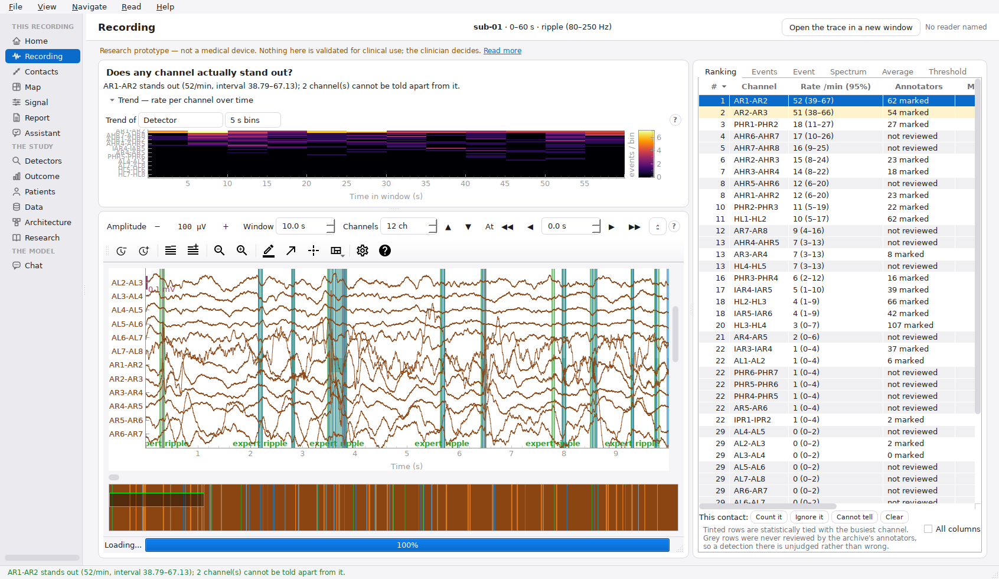

```
┌───────────────────────────────────────────────┬───────────────────┐
│  TREND     rate per channel over time         │  FINDINGS         │
├───────────────────────────────────────────────┤  channels ranked  │
│  CONTROLS  amplitude · window · channels · at ├───────────────────┤
├───────────────────────────────────────────────┤  EVENTS           │
│                                               │  one row each     │
│  TRACE     the signal, with marks on it       ├───────────────────┤
│                                               │  PATIENT          │
│                                               │  · contacts (3D)  │
│                                               │  · agreement      │
│                                               │  · provenance     │
│                                               │  · preprocessing  │
│                                               │  · quality        │
│                                               │  · assistant      │
├───────────────────────────────────────────────┴───────────────────┤
│  the caveat — always on screen                                    │
└───────────────────────────────────────────────────────────────────┘
```

There are eleven panels and the window does not show them all at once, because
a screen with eleven docked panels on it is one you have to tidy before you can
use it. By default they are arranged as **pages** — a sidebar on the left with
Home, Recording, Contacts, Signal, Report and Assistant, then the six study
pages of the results site (Detectors, Outcome, Patients, Data, Architecture,
Research, read-only, from the committed tables), one page showing at a time,
`Alt+1` to `Alt+9` to switch — the same shape as the project's results
site, with the trace on the Recording page and the ranking, the events and the
selected event in a column beside it. The diagram above and the rest of this
section describe the **docked** arrangement, which **View → Everything at once
(docked panels)** rebuilds the window into (and `onset-review --layout docks`
opens in). There, **View** opens with three layouts, one per stage of the work:

| layout | | what it shows | for |
|---|---|---|---|
| **Screening** | `Alt+1` | trend, trace, findings, events, contacts | is there anything in this window, and where? |
| **Reading** | `Alt+2` | trace, findings, events, this event, assistant | is this particular event real, and what do I think of it? |
| **Reporting** | `Alt+3` | findings, quality, preprocessing, provenance, agreement, patient | what was done to the signal, and against what |

They are not modes. Nothing is destroyed or disabled — every panel is one tick
away further down **View**, **Everything at once** shows the lot, and a panel
you tick back on stays on. The layouts are starting arrangements, not rules.

Every panel can also be dragged, floated, closed and reopened. Panels in the
same corner share a tab stack; drag one out by its title bar to give it a
window of its own — worth doing for the 3D view and for **This event**, both of
which are better large.

The window opens at the size of your screen and no larger — maximised if it
would otherwise have overflowed. The rest of **View** is about the window
itself: **Restore the default layout** puts dragged panels back, **Fit the
window to this screen** (`Ctrl+0`) is for after a second monitor or an
over-wide layout, and **Maximise window** and **Full screen** (`F11`) work
whatever your window manager does with title bars. On a short screen a panel
scrolls rather than the window overflowing; the 3D view in particular is worth
more height than a laptop's tab stack has, which is why it is floatable.

**Compact first, everything one tick away.** Every table opens in the form a
reader scans — the ranking as rank, channel, rate with its interval, and what
the annotators marked; the event list as six columns; the agreement as two
bars per channel; data quality as a strip of chips — and each has a tick
(*All columns*, *Show the table*, *Show the measurements*) that turns the
whole thing on. **View → Compact tables** flips all of them at once, and the
choice is remembered. The exported report is built the same way: the short
tables in the body, every measurement in an appendix.

### Trend — read this first

One row per channel, one column per five seconds, brightness for how many
events fell in that cell. It is the same idea as Persyst's spike trend and it
is used the same way: **find the bright patch, click it, and the trace goes
there.** Channels are in the same order as the Findings table, so the two read
across.

The trend does a second job that the tables cannot. A window whose activity is
three bright cells in four hundred empty ones *looks* like what it is. A ranked
list of rates from the same window looks authoritative.

Switch **Trend of** to *Expert markings* to see the same window as the original
annotators marked it. Flipping between the two is the fastest way to develop a
feel for what the detector is doing.

### Controls — amplitude, window, channels, position

Directly above the trace: a gain control with a readout, how many seconds are
on screen, how many channels, and where in the window you are, with buttons to
step and scroll. Everything here also has a key on the trace — these exist
because a control you cannot see is a control most people never find.

The **amplitude** readout is the height of the scale bar drawn on the trace, so
the two cannot disagree. Rescaling is the first thing to reach for: an 80 Hz
oscillation at the wrong gain is a slightly thicker line.

**Window** is the single most useful control in the program. At 10 s a ripple
is a smudge; at 1 s it is an oscillation you can count the cycles of. Marking
and rejecting events is done by the detector at full resolution regardless —
this only changes what you can see.

The amplitude readout is in **microvolts**. It is MNE's own scale bar — the one
drawn on the trace, so the two cannot disagree — converted from the millivolts
it is written in, because nobody judging a 90 µV ripple wants to do arithmetic
around "0.1 mV".

Hovering **Window** tells you the paper speed that length corresponds to: ten
seconds is a standard clinical page, 300 mm at 30 mm/s, so five seconds is
60 mm/s and twenty is 15. It is an equivalence and the tooltip says so — this
software does not know how wide your monitor is and does not pretend to.

### Trace — the signal

This is `mne-qt-browser`, the viewer MNE-Python ships, embedded rather than
reimplemented. Arrow keys scroll in time and through channels, `+`/`-` rescale,
`b` is butterfly view, `?` lists everything.

The signal is **bipolar**: each trace is one contact minus its neighbour
(`AR1-AR2`). HFO work is done this way because a common reference shares its
noise with every channel and produces oscillations that appear everywhere at
once. One consequence worth holding on to: a bipolar channel is a *pair*, so an
event on `AR1-AR2` localises to somewhere around those two contacts, not to one
of them.

Marks are coloured by band — ripples blue, fast ripples red, interictal
discharges grey — and the annotators' own marks, when you turn them on, are the
same colours washed out.

**By default only the selected channel's marks are drawn.** A minute of this
dataset holds around five hundred detections; drawing all of them turns the
trace into a barcode and hides the signal underneath. Pick a channel anywhere
and the marks follow it. **View → Marks on every channel** if you want the
barcode.

### Findings — channels ranked by rate

Sorted by events per minute, busiest first. The columns that matter:

Five columns to start with: the rank, the channel, the rate with its 95 %
interval in one cell (*52 (39–67)*), what the annotators marked on that
channel, or *not reviewed* where they never looked, which is a different
thing from zero, and your own verdict on the contact. *All columns* adds the
counts, the intervals as numbers, mean frequency, duration, prominence,
spike co-occurrence and how many of the contact's events you have judged.

| column | what it means |
|---|---|
| **Rate /min** | events per minute on that channel |
| **95% low / high** | the range the true rate plausibly lies in, given how few events a minute holds |
| **My read** | your own verdict on the contact — see [**Recording your read**](#recording-your-read) |
| **Judged** | how many of its ranked events you have given a verdict on |
| **Expert looked** | whether the archive's annotators reviewed this channel at all |
| **Expert events / min** | what they marked on it |

**The tinted rows are the point of this panel.** They are the channels whose
confidence intervals overlap the busiest channel's — that is, the channels the
data *cannot tell apart from the leader*. If eight channels are tinted, this
window has not identified one busiest channel; it has identified eight
candidates, and reporting the top one would be reporting an accident of
counting.

Grey rows are channels nobody annotated. A detection there is *unjudged*, not
wrong — so the expert columns are blank rather than zero, and the agreement
table leaves them out.

### Events — one row per detection

Time-ordered. Click a row and the trace centres on it; **Navigate → Next
event** walks the window. The filters answer the three questions people
actually ask of this list: one band, one channel, or only the events riding an
interictal discharge.

Six columns by default — your read, the time, the channel, the kind, the
peak frequency and the duration — which is what you walk with the arrow
keys. *All columns* adds amplitude, prominence, the number of peaks, the
discharge flag and the reason a rejected candidate was rejected.

**Show rejected** displays the candidates the artifact filter removed, with the
reason — useful when you can see something on the trace and want to know why it
is not marked.

The **My read** column and the row of buttons under the table are yours; see
below.

`Prom dB` is the one column that is not self-explanatory: how far the
oscillation rises above the recording's own background at that frequency. It is
what separates a real oscillation from the ringing a filter produces when it
hits a sharp transient, which is the classic way HFO detectors fool themselves.

### This event — the picture the judgement is made on

*(The tab is labelled **Event**.)*

Select an event anywhere and this panel shows it three ways on one time axis:
a row in the Events list, a cell in the Trend, or a click on the trace itself
at the event's place on its channel. The Trend and the trace pick the nearest
listed event on that channel, within a couple of seconds, and the list does
the rest; a click with nothing listed nearby moves the trace there and leaves
this panel as it was. Until an event is picked, the panel is the one sentence
saying so, not three empty frames. It is the view to use before you press `A`
or `D`, and the reason the two keys mean anything.

**Top — wideband.** The signal as the detector saw it: high-passed, notched and
re-referenced. *Not* unprocessed, and the panel says so, because the one view
whose job is to let you check the analysis must not claim to show you something
it is not showing you. What you are looking for here is whatever the event is
sitting on — a discharge, a step, a movement artifact.

**Middle — the detector's band.** What made it fire. On its own this is not
evidence, which is exactly why it is not shown on its own.

**Bottom — time-frequency.** This is the discriminator, and the single most
useful picture in the software:

> **A real oscillation is an island.** Energy confined to a band of frequencies
> and lasting several cycles.
>
> **Filter ringing is a column.** A sharp transient is broadband by definition,
> so its energy runs the whole height of the plot at one instant — and the
> middle trace, which looks like a perfectly good ripple, is the filter's work
> and not the brain's.

Band-passing an interictal spike produces something with the right frequency,
the right duration and a plausible amplitude. It is the largest single source
of false HFO detections in the literature and no amount of counting
distinguishes it. Two of these pictures side by side do, immediately.

The colours are decibels above the 0.4 s either side of the event, not an
absolute scale: every brain recording has far more energy at 10 Hz than at
200 Hz, so an absolute scale would show the bottom of the plot lit and nothing
else. The frequency axis deliberately runs wider than the detector's band in
both directions — down, so you can see the discharge a ripple is riding on, and
up, so you can see an HFO riding on a discharge. A plot restricted to the
detector's own band would agree with the detector by construction.

`onset_hfo.validate` already rejects candidates on a spectral-peak criterion
for this reason, and `Prom dB` on every event is that criterion's number. This
panel does not second-guess it; it shows you what it was computed from, so that
agreeing or disagreeing with the software is something you do from evidence.

### Spectrum — noisy, or busy?

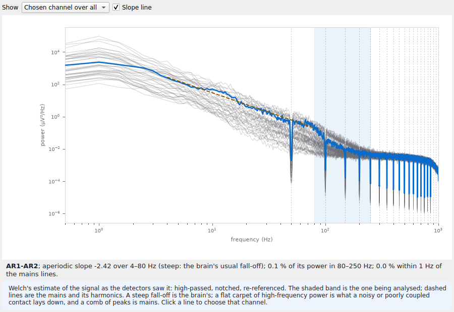

A tab beside *This event*: every channel's power against frequency on a
log-log plot, the band being analysed shaded, the mains lines dashed, the
chosen channel drawn over the rest with its slope line. It is the picture that
answers the question the Signal page's band-power flag only raises. A healthy
intracranial contact falls off steeply with frequency, a slope near −2; a
noisy or poorly coupled one lays a flat carpet of high-frequency power, a
slope near 0; a mains-contaminated one has a comb of peaks at the harmonics.
All three look alike in a rate table and nothing alike here.

The headline says the numbers the picture shows — the aperiodic slope over
4–80 Hz, the share of the contact's power in the band, the share within a
hertz of the mains lines — and reads the slope as *steep* or *flat*. Click a
line to choose that channel; *Leading five* shows the ranking's leaders
alone. The spectrum is of the signal as the detectors saw it, high-passed,
notched and re-referenced, so a notch you widened shows as a wider hole.

### Average event — what this channel's events average to

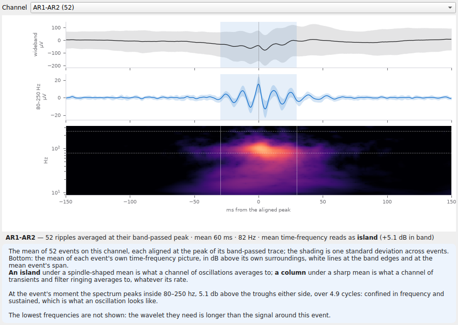

A tab beside *Spectrum*: every accepted event on one channel, cut from the
signal, aligned at the peak of its band-passed trace and averaged, in the
same three rows as *This event* — the mean wideband and band-passed traces
with their spread across events, and the mean of each event's own
time-frequency picture. One event is a judgement; fifty are a morphology. A
channel of oscillations averages to a spindle with an island under it; a
channel of sharp transients and the filter's ringing averages to a spike with
a column under it, and the two can carry the same rate. The headline reads
the mean by the same rule the single-event view applies — *island*, *column*
or *unclear* — and says how many events went into it. The box follows the
channel chosen anywhere; choosing one here chooses it everywhere.

### Threshold — does the ranking survive a stricter detector?

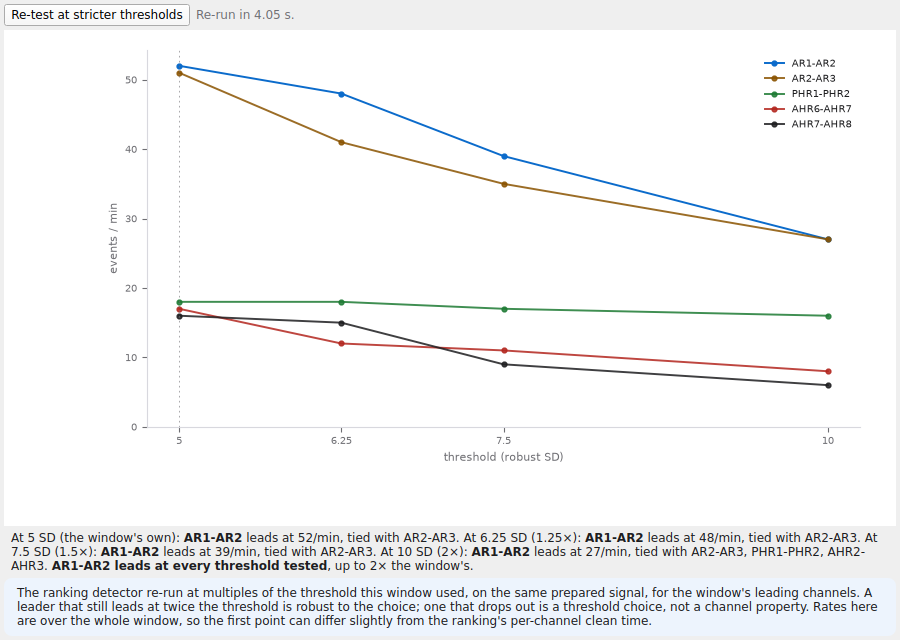

A rate is a count above a threshold, and the threshold is a choice. The tab
beside *Average* re-runs the ranking detector at 1.25×, 1.5× and 2× the
threshold this window used, on the same prepared signal, and plots the
leading channels' rates against it. It waits for the button because it costs
a few seconds. The sentence under the plot says who led at each threshold,
who was tied with them, and up to what multiple the window's leader still
led: a leader that holds to twice the threshold is robust to the choice; one
that drops out at 1.25× is a threshold choice, not a channel property. This
is the re-test the research ladder applies to every leader, on the window in
front of you. Nothing on the other pages changes.

### Recording your read

Everything above this line is an algorithm's opinion. This part is yours, and
it is kept separate from the detector's output everywhere — on screen, in the
stored file and in the exported report — because the two are different kinds of
claim. The detector's output is reproducible; yours is not, which is exactly
why it carries your name and the time you gave it.

**Say who you are first.** The window asks once, before it records the first
verdict, and will not record an anonymous one. A judgement nobody can be asked
about afterwards cannot be used for anything — not a report, not a second
opinion, not a disagreement. `onset-review --reader "Dr Smith"` skips the
question. The status bar shows whose read it is and how much has been judged.

**Judging an event.** Select it in the **Events** list and press one key:

| key | verdict | meaning |
|---|---|---|
| `A` | real | a genuine event |
| `D` | not real | artifact, filter ringing, or not an oscillation |
| `U` | cannot tell | genuinely ambiguous — recorded as such, and counted as neither |
| `Backspace` | — | take the verdict back |
| `N` | — | add a sentence saying why |

The selection moves on by itself after each one, so a long list is one key per
event. The letters work while the events list has focus; **Read → …**
(`Ctrl+1`, `Ctrl+2`, `Ctrl+3`) does the same from anywhere, and **Read → Next
unjudged event** (`Ctrl+J`) skips what you have already done.

**Judging a contact.** In **Findings**, *Count it*, *Ignore it* or *Cannot
tell*: one segmented control, the verdict already given shown filled, and
*Clear* beside it to take it back. The event verdicts are the same shape.
"Ignore it" does not delete anything or change a rate — the number stays
on screen and your verdict goes in the report beside it. Nothing in this
software removes a measurement because a person disagreed with it; it records
that they did.

**Read → Note on this window…** is where your conclusion goes. It is exported
with the review.

#### What is saved, and what survives

Every verdict is written to disk the moment you give it. There is no save
button and nothing to lose.

Your verdicts are filed against the *recording and the window* — not against
the detector settings. So changing a filter, a threshold or the quality stage
and re-running keeps them: the software re-attaches each one to the matching
event, allowing for the few milliseconds an onset moves when a threshold
changes. A verdict with no matching event left is **not deleted**. It is kept
in the file, counted in the report, and comes back if you undo the change. The
status bar tells you when that has happened and how many.

The report says three things whether or not they flatter the read: how much of
the window was actually judged, which events you rejected and why, and how many
verdicts no longer match an event. A partial read is labelled as one, and a
**confirmed rate** is quoted for a contact only when every one of its ranked
events carries a verdict — anywhere else it would be a confirmed count divided
by the whole window, which would understate a contact you had not finished.

### The findings paragraph — yours, or the assistant's, and the report says which

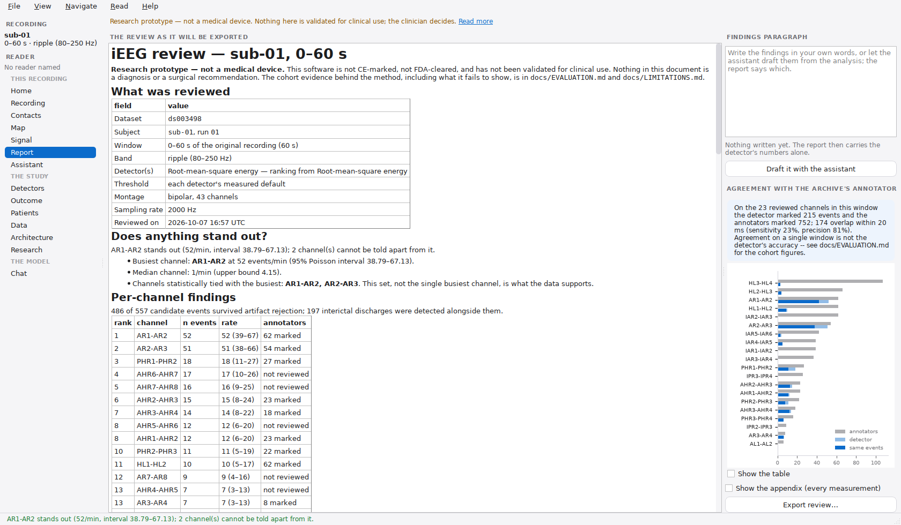

On the Report page, beside the preview, is a box for the findings paragraph:
the three to six sentences a report opens with. Write it yourself, or press
**Draft it with the assistant**. The draft goes through the assistant's whole
loop — the usual queries, the number check, the citation check — so a draft
with a number no query returned is refused like any answer, and the refusal
is on the Assistant page. A draft that passes lands in the box and in the
report under **Findings**, marked *Drafted by the assistant (model) on date …
not edited by the reader*. The moment you edit it, it is yours: the marking
becomes *Written by you*, under your reader name. A reader signing a report
has to know which sentences a model wrote, so the attribution is part of the
document and not of the screen. The paragraph is saved with your verdicts
and comes back with them.

### Patient — who this recording belongs to

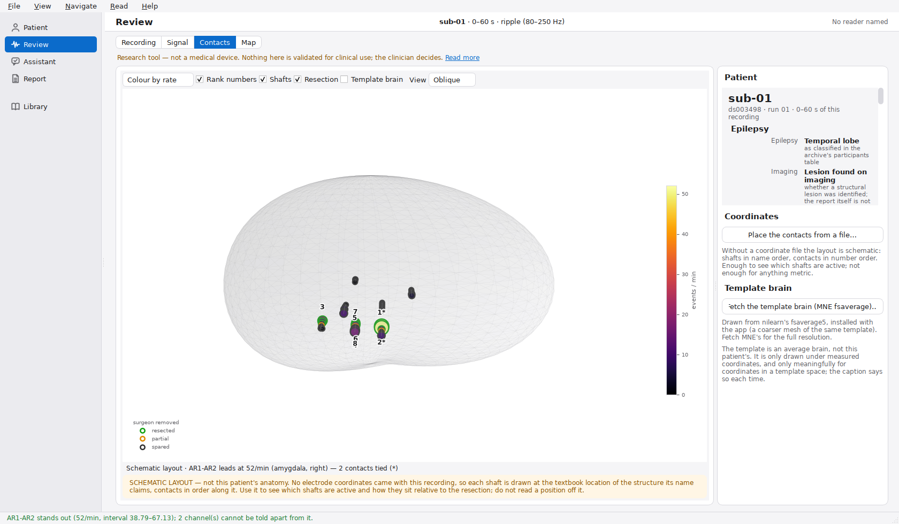

What the archive records: the epilepsy type, whether imaging found a lesion,
how many nights were recorded, how many channels the annotators reviewed, how
many contacts the surgeon removed, and whether any were eloquent cortex.

**The resection-coverage line is the one to read.** In five of these twenty
patients only a quarter of the contacts the surgeon removed appear in the
recording at all. When that is the case this panel says so in orange, because
everything the software then says about "inside the resection" for that patient
describes a quarter of their resection — and the number looks identical either
way.

**The surgical outcome is hidden until you ask for it.** Knowing a patient
became seizure-free changes how you read the same rate table, and this software
is for forming an impression from the signal. Tick the box when you want it.

> **The clinical record is empty, deliberately.** This archive carries no
> seizure semiology, no imaging report, no scalp EEG, no neuropsychology, no
> medication list and no surgical history. Those fields are listed on the panel
> so you can see where a site's own record would appear — and they are left
> blank rather than filled with a plausible example. An invented history in a
> clinical tool is indistinguishable from a real one, and that is not a risk
> worth taking for a nicer demo.
>
> Age, sex and handedness *are* in the archive and are **not** published here.
> Three demographic fields beside pathology, surgical extent and outcome narrow
> a cohort of twenty considerably, and no analysis in this project uses any of
> them. That blank is a choice, not missing data.

### Where the contacts are — the 3D view


Each contact drawn in a head, coloured by rate, with the busiest numbered in
rank order and the shafts joined so you can see which contacts belong to the
same electrode. When the dataset records what the surgeon removed, each contact
is ringed by it: green inside the resection, orange straddling it, dark outside.

What this gives you that the table cannot is **adjacency**. "`AR1-AR2` and
`AR2-AR3` lead" reads the same in a table whether they are two neighbouring
contacts of one electrode or two leaders on opposite sides of the head, and
those are completely different findings. Here you see which it is.

Click a contact to take the trace to it; pick a channel anywhere else and the
view turns to face it. **View** gives you the standard angles.

> **Read the orange banner under it.** On this archive — and on every dataset
> this software currently ships support for — the positions are **not
> measured**. `ds003498` and `ds003029` contain no `electrodes.tsv` and no
> stereotactic coordinates for any contact. What the layout uses instead is the
> electrode *names*, which do carry real information: `AHR3` is the third
> contact of the right anterior hippocampal depth electrode, and contacts along
> a depth electrode are numbered in spatial order. So each shaft is drawn at
> the textbook location of the structure its name claims.
>
> That is genuinely useful — it tells you the active contacts are all on right
> mesial temporal shafts and sit inside the resection, which is true and is the
> finding. It is **not** this patient's implantation, and no distance,
> trajectory or margin should be read off it. If you point this software at
> your own BIDS data and that data has an `electrodes.tsv`, it uses the real
> coordinates and the banner changes to say so.
>
> On a recording whose electrode names match no structure the software knows —
> most subdural montages, including `ds003029` — the banner says **montage
> diagram** instead, and means it: the shafts are fanned apart only so you can
> tell them from each other, and their positions and sides mean nothing at all.
> Even then, which contacts share an electrode and their order along it are
> real, and that is usually the question.

#### Giving it the real coordinates

Everything above is true of a recording that arrives without electrode
positions, which is every recording in both public archives. It is not true of
your patients. A post-implant CT coregistered to the planning MRI gives real
coordinates for every contact; they are simply in the planning system rather
than in the archive.

**File → Electrode coordinates…** takes that file. A BIDS `electrodes.tsv`,
or a CSV out of anything else — the columns may be called `name`/`label` and
`x`/`y`/`z` or `R`/`A`/`S`, in any order, comma- or tab-separated, with or
without a header. Millimetres and metres are told apart by magnitude and the
software says which way it read them.

Before anything moves you are told what the file would do: *"47 of 64 contacts
placed, read as millimetres. 17 contacts are not in the file and stay
schematic: …"*. That is a thing to decide about rather than discover from a
picture that looks finished and is half guessed. A file whose names match
nothing is refused outright, and a contact written `n/a` is left unplaced
rather than drawn at the origin, where it would form a cluster at the centre of
the head that looks like a finding.

Once applied, the caption stops saying *schematic* and names the file instead —
it does not claim the dataset supplied them, because it did not. Sides come
from the coordinates rather than from the electrode names, so names with no
`L`/`R` stop reading "side unknown". The file is remembered, so widening a
notch and re-running does not mean finding it again.

Two things this still does not do. The surface stays a reference shape, not
your patient's cortex: positions relative to each other are what the clinical
question needs and what a coordinate file gives. And nothing here can check
*which space* the coordinates are in — scanner, MNI and a planning system's own
frame all look identical in a four-column file.

**Nothing about a rate changes.** Coordinates move dots; they do not move
events.

**The template brain.** When the contacts are placed from a file, *Template
brain* on the 3D view draws MNE's `fsaverage` cortex — the FreeSurfer average
of forty brains, in MNI space — under them instead of the reference shape. It
is drawn only under measured coordinates (a rendered cortex under a schematic
layout would read as a registered implantation, which it is not), and only
when the file's BIDS sidecar does not name a patient space: coordinates in a
scanner's own frame on an average brain would be the wrong geometry, and the
box says so when it is greyed out. Whenever the surface is drawn the caption
says it is the template and not this patient. The surface is a few hundred
megabytes, fetched once with the button on the Contacts page; until then
the box says it is not on this machine.

### Detector vs expert

This dataset's annotators marked HFOs channel by channel, so on these
recordings you can see exactly where the detector agrees with them and where it
does not, on the minute in front of you.

It opens as two bars per reviewed channel — grey for what the annotators
marked, blue for what the detector marked, the darker blue for the events
both marked — because that is the comparison, and a glance at twenty pairs
of bars says it where eight columns take a minute. *Show the table* gives the
counts, sensitivity and precision per channel.

**The two "only" columns are what to look at.** *Only ours* is where the
detector marked something nobody did; *only theirs* is what it missed. Open a
few of each on the trace. That is the half-hour that teaches you what this kind
of detector is and is not for, and no summary statistic substitutes for it.

The percentages on a single minute of one patient are far too noisy to be the
detector's accuracy. Section 5 has the cohort numbers.

### Map — the contacts flat, with a colour scale

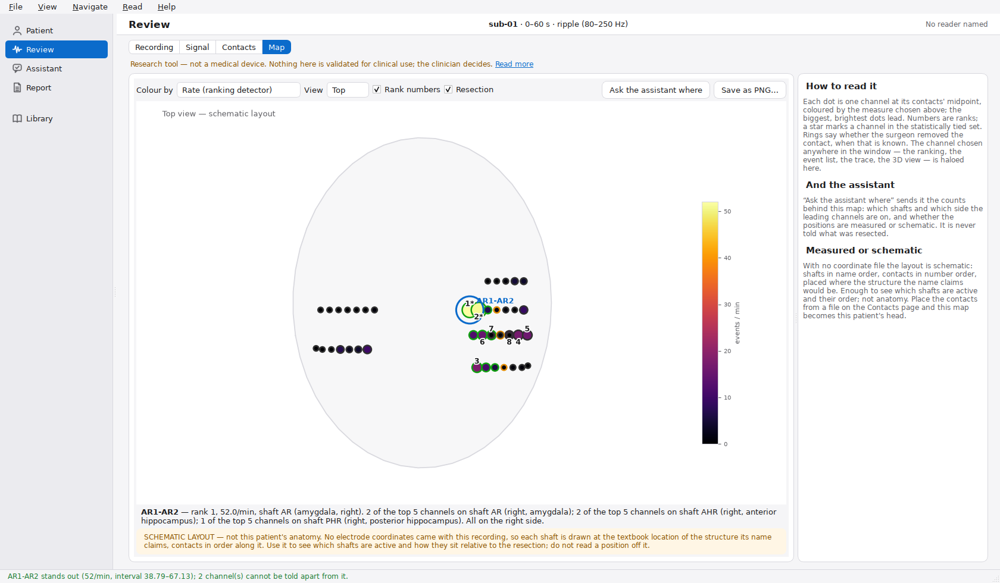

The figure a paper prints: every channel a dot at its contacts' midpoint,
coloured by the measure chosen above (the ranking detector's rate, either
detector's, discharges, the archive annotators' markings, or rank), the
biggest and brightest leading, the first eight numbered by rank, a star on
the statistically tied set, and a ring on each contact the surgeon removed
when that is known. Five views: top, left, right, front, back. **Save as
PNG** writes it at print resolution.

The channel chosen anywhere — the ranking, the event list, a click in the
trend or on the trace, the 3D view — is haloed and named here, with its rank,
rate, shaft and side, so an event under judgement can be found on the head
without leaving the page it is judged on.

**Measured or schematic, and it says which.** With a coordinate file (the
dataset's `electrodes.tsv`, or one you place from the Contacts page) the map
is this patient's head. Without one the layout is schematic — shafts in name
order, contacts in number order, placed where the structure the name claims
would be — and the title and the caption say so. It is enough to see which
shafts are active and their order along the shaft; it is not anatomy, and
no rendered cortex is drawn under it, because these archives ship no MRI and
a surface nobody measured would be a picture of nothing.

**Ask the assistant where** sends the assistant the counts behind the map:
how the leading channels distribute over shafts and sides, and whether the
positions are measured. It answers in those counts (*3 of the top 5 channels
on shaft AR (right, amygdala); 2 on PHR (right)*). It is never told what was
resected: the rings are for you.

### Assistant — ask about this window

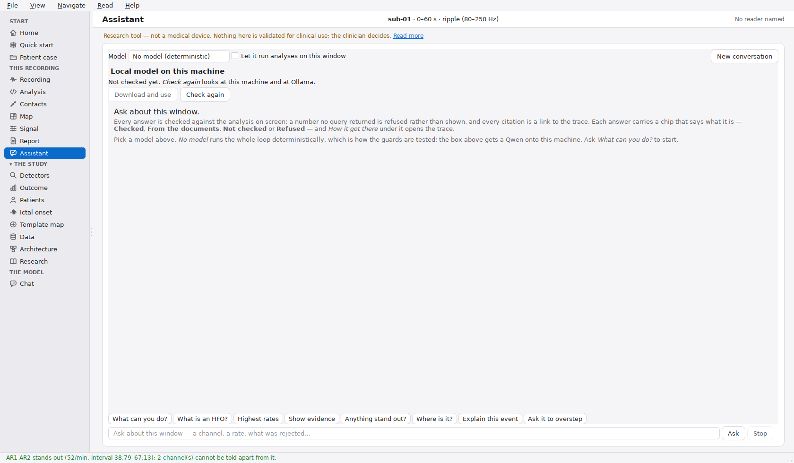

A language model that can only quote the analysis in front of you. The usual
queries — what was analysed, the leading channels, the evidence behind them,
where the detectors disagree — are run for it before it is asked anything, and
it may run more; every number it states is checked against what those queries
returned, and a number no query returned is refused rather than shown. Ask it
which channels to resect and it refuses — before the model is even called. Ask
it *What can you do?* and it tells you, also without a model.

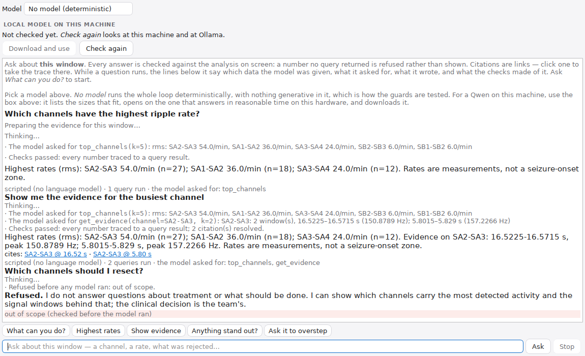

**You see the work.** Each exchange is a card: the question, the answer, and
a chip that says what the answer is — **Checked** against this analysis,
**From the documents**, **Not checked**, or **Refused**. While a question
runs, the lines under it say which data the model was given (`Retrieved for
the model top_channels: AR1-AR2 22.0/min, …`), what it asked for, what it
wrote, and what the checks made of it; when the answer lands they fold under
*How it got there*, one click away — including, on a refusal, the sentence
the model actually wrote and the check it failed. A wait is a visible
process, and a refusal has a visible cause.

**The citations are the point.** Each one is a link to a channel and a time, so
an answer leads to the signal it was measured on. When the model names a
channel without citing a window, the windows retrieved for that channel are
attached and the line says so; an id the model made up is dropped, never shown.
An assistant you cannot check is not useful here; one you can check in two
clicks is.

It opens on **No model**, which runs the whole loop deterministically with
nothing generative in it — that is how the guards are tested, and it answers
instantly. For a real model, install Ollama (`ollama serve`) and use the box
above the transcript: it lists every size this machine can serve, smallest
first, with what each costs to pull and what to expect of it. On a CPU it
opens on `qwen2.5:3b-instruct`, which answers in well under a minute where the
7B takes several; go one bigger if it misreads a table, one smaller if it is
still slow. Each Qwen2.5 size is also listed under its explicit
`-q4_K_M` name (the same file the plain tag pulls, so a model pulled by hand
as `ollama run qwen2.5:3b-instruct-q4_K_M` is found under the name you used)
and as an 8-bit `-q8_0`, which reads a table more carefully for twice the
download. The one you pick is remembered.

On a CPU the wait is the model *reading* the question and the evidence before
it writes a word, so the first question of a session is the slow one; the
second reuses what the first read. If a question runs past fifteen minutes
the panel gives up and says so; before that, **Stop** is yours. Nothing is downloaded until you
press the button, nothing leaves the machine, and an unreachable server is
reported rather than silently falling back. **Stop** ends a question that is
taking too long; the clock beside it shows how long it has been.

The numbers it quotes are the numbers in the Findings table, by construction:
it reads a pipeline result rebuilt from the same band, detectors and thresholds
the window on screen was produced with.

**It can run an analysis, if you let it.** Tick *Let it run analyses on this window* and the
model is offered six more things to do: run a detector with different
settings, count discharges, measure band power, compare the two detectors,
ask which channel leads the others, and the channel-quality checks. Each is
the pipeline's own code, reproducible by name and run id; each costs seconds
to a minute, and the transcript says *Ran an analysis … (12 s)* when one
runs. The box is off by default and forgotten with the session, so a
question never silently re-runs the detectors.

**It explains the event you have selected.** With an event picked anywhere,
*Explain this event* (or any question with "this event" in it) hands the
model the measurements of that event's own picture — its cycles, how far its
power stands above the bands either side at that moment, and the panel's reading
of it, *island*, *column* or *unclear* — and the answer is about that event and
no other. The reading is the software's, written under the picture; the
model puts it into words.

**It remembers the conversation.** A follow-up ("and the one below it?") is
answered with the last few exchanges in view. *New conversation* forgets them.

**It answers background questions from the documents.** "What is an HFO?",
"why is the notch 2 Hz wide?", "what does the interval mean?" are answered
from this project's own glossary, methods, guide and evaluation: the
sections it drew on are named under the answer and open on a click, and a
number the sections do not state is refused like any other. A question
neither the analysis nor the documents cover is answered by the model alone
under a **Not checked** banner, so it never reads as verified. A medical
question that gets that far is refused instead.

**It knows what the window has already computed.** Once the Threshold tab has
run, a question about thresholds ("does AR1-AR2 survive a stricter
threshold?") is answered from that re-test at no cost, and the model is
briefed with it before it is asked. Before the tab has run, the same tool is
offered only with *Let it run analyses* ticked, because it costs seconds.

**It can look at the other minutes.** When other windows of the same
recording are on this machine, "is there an earlier minute?" lists them, and
with analyses allowed, "did the leader change between the two minutes?"
analyses the other window with this window's settings — same band, detector,
threshold and preprocessing, so the two are comparable — and compares the
leaders and tied sets. That takes seconds to half a minute the first time and
is free after; the answer says, as the tool does, that a leader changing
between minutes is the usual case and the tied sets are what to compare.

### Chat — the model on its own

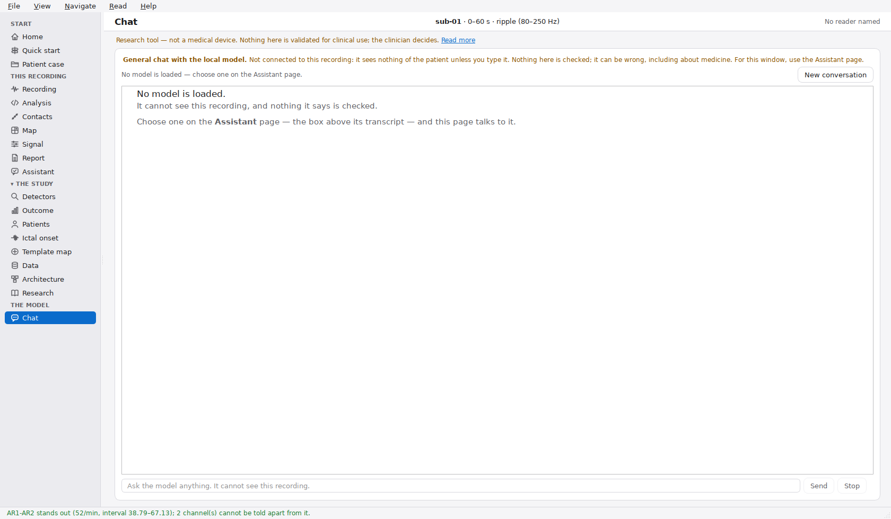

A page of its own, under **The model** in the sidebar, there whether or not
a recording is open. It talks to the same local model the Assistant uses,
with none of the Assistant's machinery: no briefing, no tools, no number or
citation check, no refusals. Ask it what you like.

Three things keep it honest beside the rest of the window, and none of them
is a restriction on you. A line at the top says, permanently, that the
page is not connected to this recording and that nothing on it is checked,
including about medicine. No patient data reaches it: the model sees nothing
of the recording unless you type it. And nothing from it enters the report
or your saved read. Until a model is chosen on the Assistant page the page
says so and waits; with one, an empty page offers three questions to try.
What a 3B model knows about medicine is uneven; where the machine allows,
the 7B the hardware chooser offers is the better companion.

### Workspace and Files — the panes beside the pages

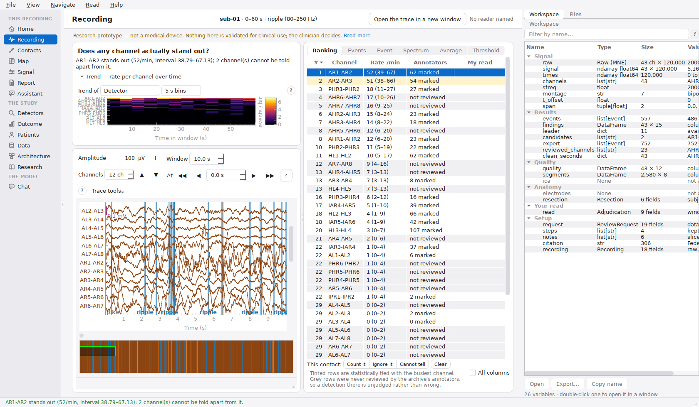

For anyone who has used MATLAB or Spyder: the **Workspace** pane lists every
object the open window holds, grouped — *Signal* (the MNE `raw`, the samples
as an array, their times, the channel names), *Results* (every event, the
ranking, the tied set, the expert markings), *Quality*, *Anatomy*, *Your read*
and *Setup* (the request, the preprocessing steps). Each row gives the type,
the size and a glimpse of the value. Double-click one to open it in a window
of its own: a sortable table for tables and event lists, the channels ×
samples array with each column's time in the original recording, a tree for
the request and your verdicts.

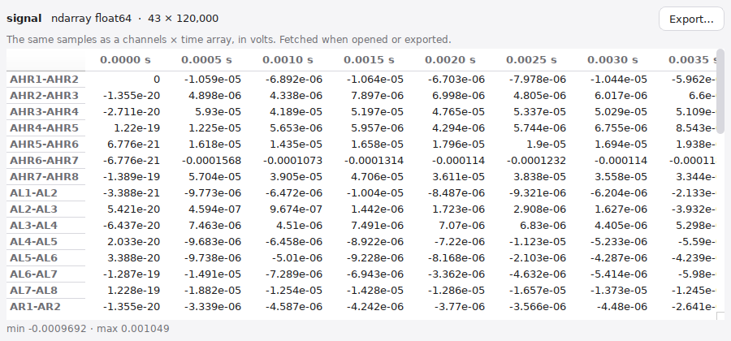

Nothing in these windows changes the analysis; they are read-only. *Export…*
writes a copy — .csv for a table, .npy for an array, .json otherwise — and
suggests the current folder. The signal array is fetched only when opened or
exported: a minute at 2000 Hz is several million numbers, and the list does
not pay for them to be drawn.

The **Files** pane is the current folder, remembered between launches.
Recordings the importer reads, scripts and notebooks are in full colour,
everything else greyed. Double-click a recording to open it — through the same
channel-type confirmation as *File → Open a file…*, because the file's own
channel types are usually wrong — and a script or notebook to open it in the
Analysis page's editor.

Both panes can be dragged to any edge, tabbed together or apart, floated as
windows of their own, or closed; *View → Workspace* and *View → Files* bring
them back, and the arrangement is kept for next time. On a laptop screen they
start hidden and open as floating windows, so that the Recording page keeps
its width.

### Console — your own analysis, on the window's own objects

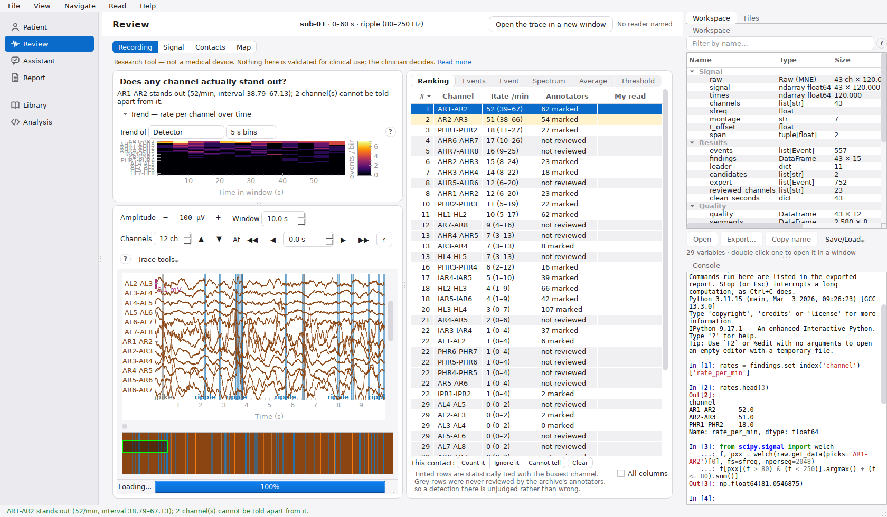

For an analysis this software does not do, **View → Console**
(`Ctrl+Shift+I`) opens Python in the window's memory, the way Spyder's IPython
console works. The names are the window's own objects, not copies loaded
again from disk:

| name | what it is |
|---|---|
| `raw` | MNE's Raw: the window as analysed, after preprocessing, in volts |
| `events` | every detection, accepted or rejected, as Event objects |
| `findings` | the ranking table: one row per channel |
| `request`, `read`, `recording` | what was asked for, your verdicts, the fetched slice |
| `signal`, `times`, `quality`, `segments`, … | every other name the Workspace lists, the same object |
| `session` | all of the above |
| `np`, `pd`, `mne`, `plt`, `onset_hfo` | imported |

A figure drawn there opens in a window of its own. Names you make appear in the
Workspace under *Console*, where a double-click opens them like any other. The
working directory is the Files pane's folder, and changing one changes the
other. The console keeps what was made in it when the window is re-analysed:
its names then point at the new analysis, and yours stay.

**What it costs.** The console runs in the window's own thread: a computation
that takes a minute holds the window for a minute. And because it works on
the window's own objects, a command can change what the panels and the report
show — reassigning a value in `findings` changes the table. So every command
run in a window is printed, in order, in the exported report under
*Python console*: a reader of the report can always see whether a console
touched the numbers in it. Nothing is written to disk unless a command does it.

### Analysis — your own scripts on this recording, with Python written for you

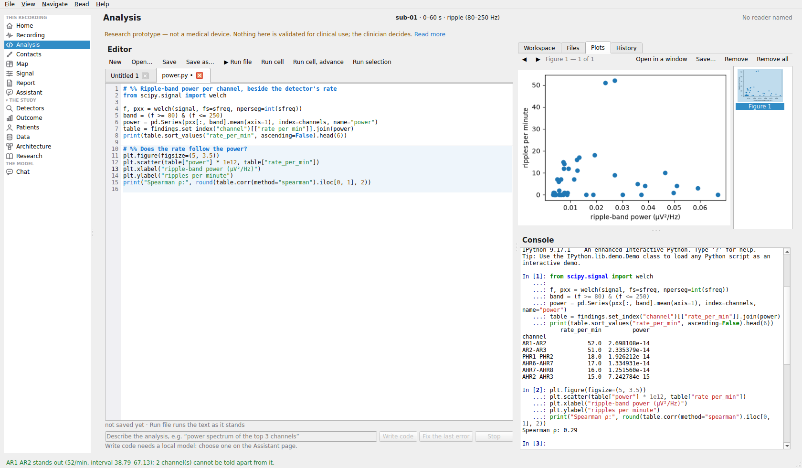

The **Analysis** page, under Recording in the sidebar, is Spyder on one page:
an **Editor** of scripts on the left; the Workspace and Files tabbed on the
right, the Console under them. They are the same panes as View's — brought
onto this page while it is open and returned to where they were when you
leave it — so a name made here is in the Workspace on every page.

Every name the Workspace lists is the same object in the console: `raw`,
`signal`, `times`, `channels`, `sfreq`, `events`, `findings`, `quality`,
`segments`, `read`, `request` and the rest. `signal` is `raw`'s own samples
(channels × time, volts), **read-only**: `np.array(signal)` makes a copy you
can change, and nothing you do to a copy reaches the analysis.

| key | runs |
|---|---|
| `Ctrl+Enter` | the cell the cursor is in; a cell starts at a line beginning `# %%` |
| `Shift+Enter` | the cell, then moves to the next |
| `F9` | the selected lines, or the line the cursor is on |
| `F5` | the whole file, saved first |
| `Ctrl+S`, `Ctrl+N`, `Ctrl+/` | save, a new tab, comment lines in or out |

A **notebook** (`.ipynb`) opens as `# %%` cells, Markdown kept as comments,
and saves back as a notebook — without outputs, since the outputs are
whatever the console prints when you run the cells here. Double-click a
script or a notebook in the Files pane to open it. Open tabs, and any text not
yet saved, are kept for the next launch. A file run with `F5` is written into
the report's *Python console* section whole, not only its name, so a number
that came from a script can be traced to the script.

**Write code.** Under the tabs, say what you want in words — *“power spectrum
of the three busiest channels”* — and the local model chosen on the Assistant
page drafts it. What the model is told is the inventory, never the data: each
Workspace name with its type and size, a table's column names, a dict's keys.
The draft opens in a tab of its own that begins by saying a model wrote it and
nothing checked what it computes. What *can* be checked without running it is
listed under the request and at the top of the draft: whether it parses, any
name it reads that does not exist (the commonest way a small model's code
fails), and any call that deletes files, starts a program or uses the network.
**Nothing runs a draft but you.** After an error, *Fix the last error* sends the
error and the script back for a corrected draft. A request for a medical
decision gets no code.

**Saving and loading variables.** The Workspace's *Save/Load* saves what you
made in the console — `.pkl` keeps everything, `.npz` arrays and numbers,
`.mat` opens in MATLAB — and says which names a format could not hold.
Loading puts the names back into the console; a saved `raw` comes back as
`raw_loaded` rather than replacing the recording on screen. A `.pkl` file can
run code as it is read, as every pickle can: load only one you made or trust.

What this page does not make the software: a point-and-click analysis suite,
or a place where a console result changes the panels. A rate computed here is
not on the Ranking or the Map. The report lists what was run; the panels show
what the pipeline computed.

### The study pages, against this recording

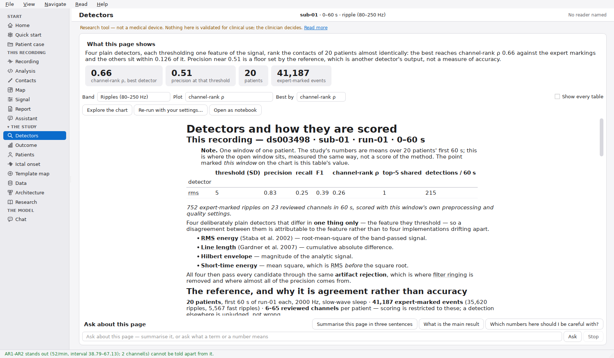

The six study pages are the project's published record and say the same
thing whatever is open. With a recording open, each gains a section headed
**This recording**, always caveated as one window of one patient:

- **Detectors** scores this window against its expert markings exactly as the
  study scored each patient — same functions, reviewed channels only — and
  marks it as a star on the sweep. A recording without markings has nothing to
  score against; the page says so and shows how far the detectors that ran
  agree with each other instead.
- **Outcome** rings a study patient's dot. For anyone else it says the plain
  thing: the result describes 20 patients and cannot be applied to one, and
  nothing in this software predicts an outcome.
- **Patients** opens on the open subject; **Data** lists the open file's facts
  beside the two archives; **Architecture** lists the steps this analysis
  actually ran, with its settings.

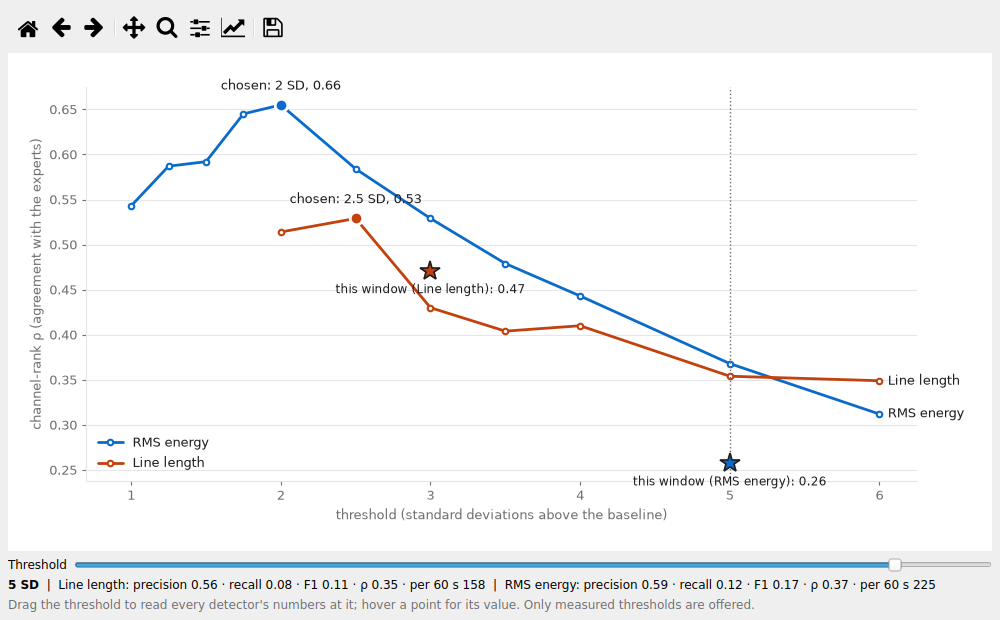

**Explore the chart** opens the page's figure live: hover a point or a dot for
its value or its patient, click a patient's dot to open their window, and on
the sweep drag the threshold — the readout gives every detector's measured
numbers at it, from the committed table, never between the measured points.

**Re-run with your settings** runs the Detectors or the Outcome study again
with your band, detectors, thresholds and window, through the study's own
functions, in the background, one patient at a time (Stop ends it between
patients). By default only recordings already on this machine are used. The
result appears under *Your re-run — not the published study* and dashed on
the chart; every skipped patient is named with the reason. The committed
tables are never touched.

**Your cohort.** On the Outcome page, *Add this recording to your cohort*
measures the open window the way the study measures a patient — the channels
tied with the busiest, and the share of them inside the contacts you tick as
resected — with the outcome you enter. With two or more patients in each
group the page gives the study's own comparison (AUC with its interval and a
permutation p) and the smallest effect groups that size could detect; with
fewer, it says a comparison is not possible. It is yours, kept on this
machine, unvalidated, and labelled so everywhere it shows.

**Open as notebook** writes the page as a notebook that rebuilds it from the
same tables with the same functions — its recomputed AUC is the page's — and
opens it on the Analysis page, the starting point for a question of your own.
The six pages fold away under their heading (click *THE STUDY* in the
sidebar); `Alt`+number still reaches them.

### When something goes wrong

**Help → Report a problem…** saves one file to send: the software's versions,
this machine, and the window's own log of what it did — what was opened, each
background job and its timing, every error. It names the recordings that were
opened but holds no signal. **Help → Test the local model…** grades the
assistant and *Write code* with the model you use, on this machine, and keeps
the result for the next report.

### Keeping the screen clear

The panes and the windows they open are there when wanted and gone when not.
**View → Pane layout → Page only** (`Ctrl+Shift+P`) closes every pane in one
step; **Spyder** and **MATLAB** put them back in those programs' arrangements.
**View → Close variable and figure windows** clears every window the
Workspace and the Console opened. **View → Page sidebar** (`Ctrl+Shift+B`)
hides the list of pages, leaving the page the whole width; `Alt+1`… and the
View menu still move between pages. **F11** is full screen. The choices are
kept for the next launch, and **View → Restore the default layout** undoes
them.

### Preprocessing — change what is done to the signal

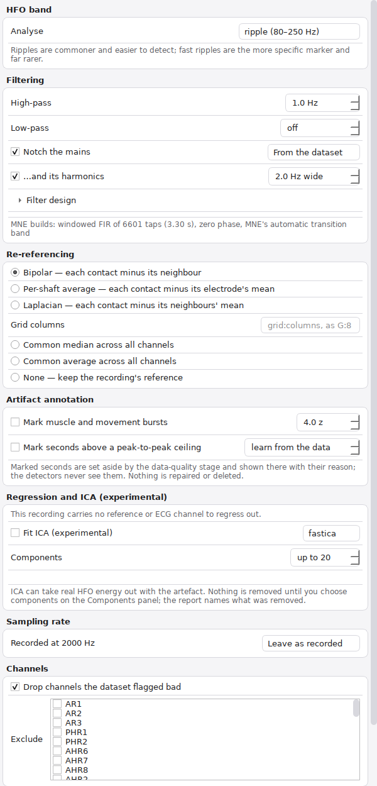

Everything here was always being done — the pipeline high-passes, notches and
re-references before any detector sees the signal — but until now it could only
be changed by editing Python, which in practice meant nobody changed it and
nobody checked whether the defaults suited their recording. These are the same
MNE operations (`filter`, `notch_filter`, `resample`, `drop_channels`), with a
mouse on them.

| control | what it does | what to watch |
|---|---|---|
| **High-pass** | removes drift | anything up to 80 Hz is free; above that it eats the ripple band |
| **Low-pass** | off by default | an HFO band runs to 500 Hz. A low-pass below that removes the signal and leaves a rate |
| **Notch** | mains and its harmonics | harmonics at 180 and 240 Hz sit *inside* the ripple band. Turn the notch off and they are detected as oscillations |
| **Notch width** | 2 Hz by default | wide notches carve visible holes in the band you are measuring |
| **Filter design** | folded away under *Filter design*: FIR (MNE's default) or IIR Butterworth; zero-phase or causal; the transition band, or *auto* | the line under the controls says what MNE builds — "windowed FIR of 6,601 taps (3.3 s), zero phase" — because a filter's ringing is as long as that number says. A narrow transition band makes a long filter that rings hard round a sharp edge; a high-order IIR does the same |
| **Re-referencing** | bipolar, per-shaft average, median, common average, or none | see below |
| **Muscle** | marks seconds of broadband muscle activity (MNE's `annotate_muscle_zscore`) | the marked seconds are set aside on every contact, and the Signal page says *annotated: muscle* for them. A low threshold sets aside a lot of a busy recording |
| **Amplitude** | marks seconds whose peak-to-peak amplitude exceeds a ceiling, per contact (MNE's `annotate_amplitude`) | the ceiling can be typed in microvolts or *learned from the data*, the way autoreject's global threshold is: the value that best separates the recording's own seconds from its outliers under cross-validation. Large discharges exceed it too, and are set aside with the artefacts; look at what was marked before trusting the rate |
| **Regress out** | the signal of an ECG lead, a reference or a ground channel the export carries, regressed out of every brain channel by least squares before the montage | the channel itself is never analysed. Regression removes whatever part of each contact follows the lead; a contact that genuinely shares a rhythm with it loses that rhythm too. Offered only when the recording carries such a channel |
| **Fit ICA (experimental)** | MNE's ICA on the filtered channels; the components appear on the **Components** tab under Provenance, scored for muscle and ECG | **removes nothing by itself.** ICA can take real HFO energy out with the artefact and the literature is split on using it for HFO work. You choose components there; the report names what was removed |
| **Sampling rate** | downsample | 1000 Hz cannot carry the fast-ripple band at all |
| **Channels** | tick a contact to exclude it | exclusion happens *before* the bipolar montage, so removing one contact removes both pairs it was part of |

**On re-referencing.** Bipolar is the default and is standard for HFO work: a
common reference shares its noise with every channel and produces HFOs that
appear everywhere at once. Common average is standard elsewhere in EEG and is
offered for comparison, but it re-introduces exactly that shared noise — the
step it writes into the report says so. Two others sit between: the
**per-shaft average** subtracts each electrode's own mean, so what one shaft
picks up in common (its own cable, its own amplifier bank) is removed without
sharing another shaft's noise with it; the **median** is a common reference
that one wild contact cannot drag along with it. Each is written into the
report under its own name.

**What is marked, not repaired.** The two annotation steps follow MNE's own
rule for artefacts: they *mark* seconds, they do not clean them. A marked
second is set aside the way a clipped one is — it leaves the analysed time, the
rates are over the time that remains, and the Signal page shows it with its
reason — so a recording with a minute of chewing in it is rated on the other
four, not on five with the chewing interpolated. Nothing here runs a repair.

Three things make this safe to play with:

* **Nothing is applied silently.** Every change writes a line into *How this
  was produced* and into the exported report. Widen the notch to 6 Hz and the
  report says 6 Hz.
* **Settings that would produce numbers rather than a measurement are
  refused.** Set the low-pass to 150 Hz while reviewing ripples and the panel
  turns red and declines — the detector would run and its rates would mean
  nothing. You find out from the panel, not from a dialog thirty seconds into a
  re-analysis.
* **The defaults are the measured ones.** Open the panel, press Apply without
  touching anything, and nothing changes — the button is disabled until you do.
  **Reset** returns to exactly that.

**Apply re-runs the whole window** from the signal up, because every number on
screen depends on these settings: the rates, the intervals, the tied set, the
trend, the 3D layout, the agreement with the annotators, the assistant's
evidence. The panels you have dragged into place stay where you put them.

### Components — what ICA found, for you to choose from

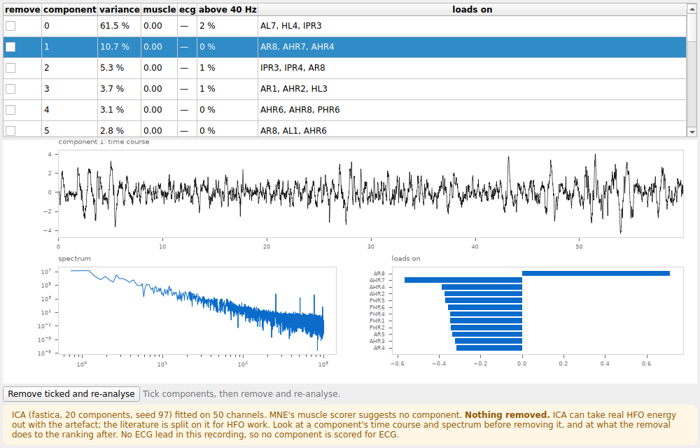

A tab beside Provenance on the Signal page, empty until *Fit ICA* is on and
applied. Then one row per component: its share of the variance, MNE's muscle
score where the recording carries electrode positions (without them MNE's
score has nothing spatial to work with, so it is not run and the panel says
so; the share above 40 Hz is the guide instead), its ECG score when the
recording has an ECG lead, how much of its power lies above 40 Hz, and the
three contacts it loads on most. Select a row
to see its time course, its spectrum and its loadings. Tick the ones to
remove and press **Remove ticked and re-analyse**: the choice goes through
the Preprocessing panel's Apply like any other setting, so the steps and the
report say *removed 2, 5 (the reviewer's choice)*, with the same seed, so a
re-run finds the same components in the same order.

Why it is experimental, and why it removes nothing on its own: a component
that carries muscle also carries whatever ripples were on the contacts it
loads on, and removing it removes them. MNE's scores are a guide, not a
verdict. Look at the time course and the spectrum before removing anything,
and at what the removal did to the ranking afterwards; the Threshold tab is
a fair place to check. On a span long enough to be analysed chunk by chunk,
ICA is left off and the dataset notes say so.

### Data quality — which contacts and which seconds were analysed

*(The page is labelled **Signal**; in the docked arrangement the panel is the **Quality** dock.)*

The contacts are a strip of chips, the ones to look at first: red for set
aside, amber for analysed but flagged, blue for one you reinstated, green
for analysed. Hover for the reason, click to select the contact. The
measurement table opens on its own when a contact was set aside or flagged;
otherwise it is behind *Show the measurements*, and the explanation of why
nothing is repaired is behind its own tick.

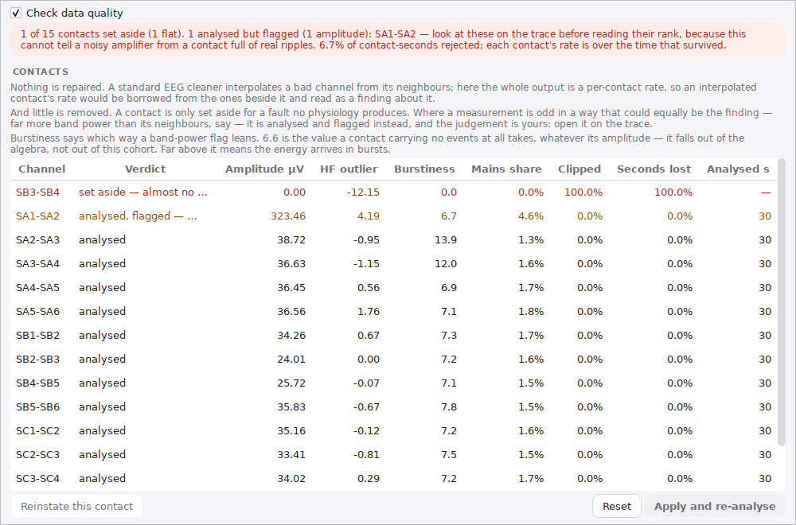

A rate ranking is unusually easy to poison, and both ways it fails look like
findings. A contact with a noisy amplifier produces band-limited energy all the
time; the detector finds it, the artifact check cannot throw it out (its
question is "is a narrow-band oscillation present?" and the answer is yes), and
that contact tops the table with a tight interval and agrees with itself in
every other panel. A dead contact fails the other way: no events, bottom of the
table, reassuring.

So before anything is detected, each contact gets five measurements and each
second gets one. **The verdicts come in two kinds, and the difference is the
most important thing on this screen.**

| | what it means | what happens to the contact |
|---|---|---|
| **Set aside** | no physiology produces this: flat, clipped at the amplifier's rail, swamped by mains, or too little surviving time to rate | not analysed. Its rate is **blank**, not zero, and its rank is blank. It keeps its row |
| **Analysed, flagged** | a measurement is unusual in a way that is *as consistent with the finding as with a fault* | analysed, ranked and rated like any other. You are asked to look at it |

**Why the second row exists.** The band-power check is the one that catches a
noisy amplifier, and it is the most valuable check here. On **sub-13** it
flagged `TR1-TR2` and `TR2-TR3` at 10× and 6× the montage's median — and the
archive's own annotators had marked **91, 102 and 164** ripples on those three
contacts. They are among the most epileptically active in the recording. A
contact full of real ripples has high band power *because the ripples are in
the band*, and nothing in this software can tell that from an amplifier. Had it
set them aside, it would have deleted the finding and shown you a cleaner
table.

That is the general rule here: **it removes only what cannot be real, and
flags what it cannot judge.**

**Burstiness says which way a band-power flag leans.** High band power on its
own cannot tell a noisy amplifier from a contact full of ripples. *How* that
power arrives can: events are tall spikes over a quiet floor, an amplifier is
a raised carpet. The column is the 99th percentile of the ripple-band envelope
over its 10th — and **6.6 is the value a contact with no events in it takes,
whatever its amplitude**, because band-passed noise has a Rayleigh envelope and
the ratio falls out of the algebra rather than out of this cohort.

| burstiness | reads as |
|---|---|
| ≈ 6.6 | *hf noise* — no event structure at all; a noisy or poorly-coupled contact |
| well above | *hf active* — the energy arrives in bursts |

On sub-16 this splits one shaft cleanly: `TL1-TL2` scores **38.7** and carries
170 expert-marked ripples; `TL6`–`TL10` score **6.5–6.7** and carry none
between them. Both ends were flagged by band power alone.

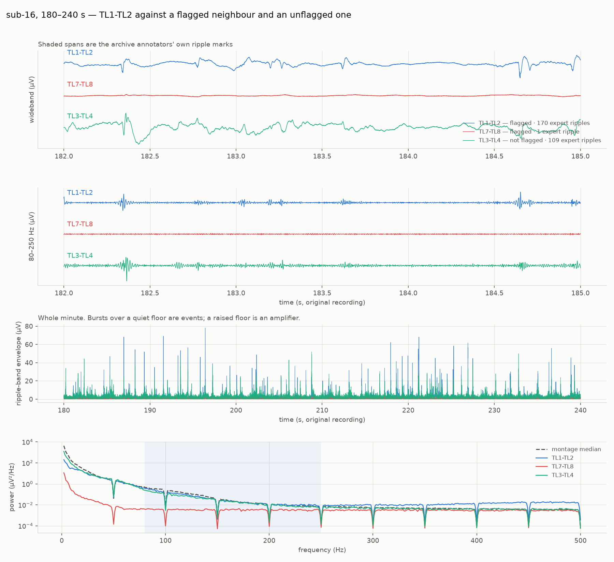

Read the middle panel: `TL1-TL2` in blue is bursts over near-silence,
`TL7-TL8` in red is a thin flat line with no events in it at all.

It is a lean, not a verdict, and it has two limits worth knowing. It separates
*events* from *carpet*, not real from artifactual — an electrode popping once a
second is bursty too, and scores like a hippocampus full of ripples. And the
separation rests on 11 contacts against 11 from this one archive. Which is why
the number is shown beside the label: neither reading removes anything, and
both still say *open it on the trace*.

Here is sub-13 with the stage running. `TR3-TR4`, `TR2-TR3` and `TR1-TR2` hold
the top three places — and two of them are flagged. Their rates and ranks are
untouched; what the software is saying is "look at these before you quote
them".

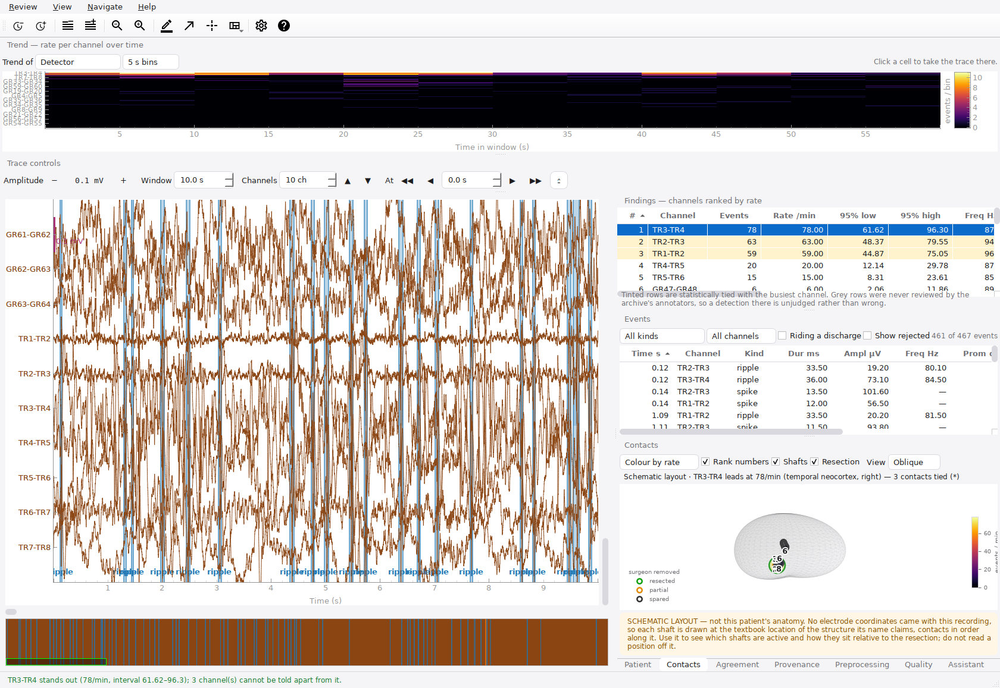

On the twenty-patient archive this stage changes nothing: the rate tables and
the leading channel are identical with it on and off for every subject
checked. It earns its place on a recording from a clinic, not on a curated
research archive.

**Blank is not zero.** In the Findings table, a contact with rate `0.00` was
analysed and no events were found — a measurement. A contact with a blank rate
and rank 0 was not analysed at all. The difference matters when you are reading
the bottom of a ranking.

**Seconds, not just contacts.** Each second of each contact is tested for a
*discontinuity* — a step no physiology produces. It is deliberately not tested
on amplitude: an interictal discharge is the largest thing in a normal second,
and an amplitude test throws away exactly the seconds that carry the pathology,
on the channels that carry it. (It did, on sub-01: six seconds of `AR2-AR3`,
the second busiest channel in that window. That is why the test changed.)
Each contact's rate is then divided by **the time that survived**, not by the
nominal minute — otherwise rejecting an artifact would make the table less
accurate than leaving it in.

**Two controls, and no more.** *Check data quality* turns the whole stage off,
which reproduces the numbers this project measured before it existed.
*Reinstate* puts a **set-aside** contact back after you have looked at it —
greyed out on a flagged row, because a flagged contact was never taken out.
To remove a contact the checks passed, use *Channels* on the Preprocessing
panel, where it is recorded as your decision.

### How this was produced

Every step applied to the signal, in order, plus the dataset's own notes and
its citation. If a number on screen ever has to be defended, it starts here.

---

## Analysing more than a minute

A minute is enough to demonstrate a method and not enough to measure a patient.
Clinical HFO rates are quoted from ten-minute or hour-long interictal windows,
and an hour of 2 kHz signal on 64 channels is 3.7 GB before a single filter
runs — which is why, until now, this software analysed what it could hold.

```bash
onset-review --open /data/study.edf --window 0 60 --span 600
```

**Analyse ten minutes, look at one of them.** The ranking, the confidence
intervals, the trend, the event list and the quality verdicts all cover the
whole span; the trace holds the minute you asked for. The status bar says so in
as many words, because every rate on the screen is then over ten minutes while
the signal under it is over one, and that is not a thing to leave anyone to
work out.

**Click any event and the minute it is in loads.** Nothing is re-analysed —
the ranking, the events and your own verdicts belong to the span and would be
wrong to recompute. The trend is the place to look first: it is the one view
that shows all ten minutes at once, so a bright patch at 7:20 is how you find
the minute worth loading.

Times in the tables count from the start of the **span**, not from the start of
the loaded trace, and `File time s` is the recording's own seconds as always.
Your verdicts are filed against the span, so working a ten-minute read does not
leave ten separate files behind.

### What it costs, exactly

The analysis runs in chunks with the signal let go between them, and reads the
recording twice — once to measure every detector's threshold over the *whole*
span, once to detect with those fixed numbers. That second pass is the price of
an answer that does not depend on where the chunk boundaries fell, and it is
the defect this project refuses to reintroduce: a busy five minutes that
measured its own threshold would hide its own events.

Measured on 200 s of synthetic signal, chunks of 30 s, 60 s and 100 s give
**byte-identical** HFO events — same channels, same onsets to the last decimal.
Against the same signal analysed in one piece they are the same events, one for
one, with onsets agreeing to floating point where the baseline sketch holds
every sample and to within 6.5 ms where it subsamples.

Two things are not chunk-independent, and the software says both rather than
leaving you to find them:

* **Discharge counts move a little.** The spike detector takes its threshold
  from the data it is given and has no baseline to inject. Over that same
  200 s, 30/60/100 s chunks give 597/600/601 discharges — a spread of 0.7%.
* **Quality verdicts are per chunk.** There is no honest way to merge ten
  chunks' medians into one whole-span median without rewriting the stage, so
  this does not pretend to: each chunk is judged, a contact set aside in any
  chunk is set aside for the span, and the Quality panel's `chunks_bad` column
  says how many chunks condemned it. Conservative on purpose — a contact flat
  for one minute in ten is not one whose ten-minute rate means anything — and
  visible, so you can disagree.

Below 180 s nothing is chunked: the span fits in memory, the direct path is
simpler, and none of the caveats above apply.

## 3. Working through a patient

1. Open **sub-01**, the first minute, the ripple band. Leave the threshold at
   the measured default.
2. **Read the status bar first.** Either a channel stands out or no channel
   does, and that sentence changes what the rest of the screen is worth.
3. Look at the **trend**. Is the activity concentrated on a few channels, or
   smeared everywhere?
4. Look at the **tinted rows** in Findings. One tinted row means a leader;
   eight means a candidate set.
5. Switch the trend to **Expert markings**. Same patch? Different patch?
6. Open **Detector vs expert**, sort by *Only theirs*, and open three of them
   on the trace. What did the detector miss, and would you have marked it?
7. Open **Where the contacts are**. Are the busy contacts neighbours on one
   shaft, or scattered? Are they inside what the surgeon removed?
8. Open the **Assistant** and ask it something you already know the answer to
   from the table. Then ask it which channels to resect, and read the refusal.
9. Open **Preprocessing**, widen the notch to 4 Hz, and press Apply. Watch the
   rates move. That is how much of this number is a filter choice, and it is
   worth knowing before quoting one.
10. Open **Data quality**. Any contact flagged there needs looking at on the
    trace before you read its rank — the software is telling you it cannot
    tell a noisy amplifier from a great deal of real activity. On sub-13 the
    two flagged contacts are the ones the annotators marked most heavily.
11. Now **work the list**. Select the busiest channel, filter Events to it, and
    press `A`/`D`/`U` down the list. Twenty events will tell you more about
    whether to believe the rate than any column will, and your verdicts go in
    the report under your name — including the ones where you disagreed. Mark
    the contact itself *Ignore it* if the answer is that its signal is not
    worth counting.
12. Now the same patient's **second minute** — **File → Next window**
    (`Ctrl+Shift+Right`), which re-analyses the next stretch of the same
    length and keeps your name, your coordinates and your panel layout.
    **Go to window…** (`Ctrl+G`) takes you anywhere in the recording, in the
    same original-recording seconds every time in this software is quoted in.
    Does the answer hold?

Step 12 is the one most worth doing, and the one most likely to surprise you.
Across these twenty patients, the annotators' own busiest fast-ripple channel
is the same channel in only **7 of 20 patients** when you compare one minute of
a recording against another minute of the *same* recording. That is the
experts, not our detector. A single-minute answer — from anyone — is less
stable than it looks, which is why this interface puts confidence intervals and
a candidate set in front of you rather than a number.

**File → Export review…** writes everything above to a file, with the
provenance, the caveat and the tables. Re-running the same patient, window,
band, detector and threshold reproduces it exactly.

---

## 4. The settings you can change, and what they cost

**Band.** Ripples are commoner and easier to detect; fast ripples are the more
specific marker and are far rarer. On a 1000 Hz recording the fast-ripple band
is greyed out — a 500 Hz band needs more than 1000 Hz of sampling, and
analysing it anyway produces numbers that look fine and mean nothing.

**Detector.** Four are offered. They are different ways of asking "is this
stretch unusually energetic in this band": root-mean-square energy, line
length, Hilbert envelope, short-time energy. On this cohort they rank channels
very similarly; the feature choice matters much less than the threshold does.

**Threshold.** How far above a channel's own background a burst must rise to be
marked, in robust standard deviations. Lower finds more and marks more noise;
higher is more confident and misses more. The default is the value measured for
each detector on this cohort — not a value anyone picked by eye. Section 5 says
what moving it costs.

**Interictal discharges.** Detected alongside, and marked rather than removed.
HFOs riding on a discharge are a real and clinically distinct population, and
the `On spike` column tells the two apart.

---

## 5. Opening a recording of your own

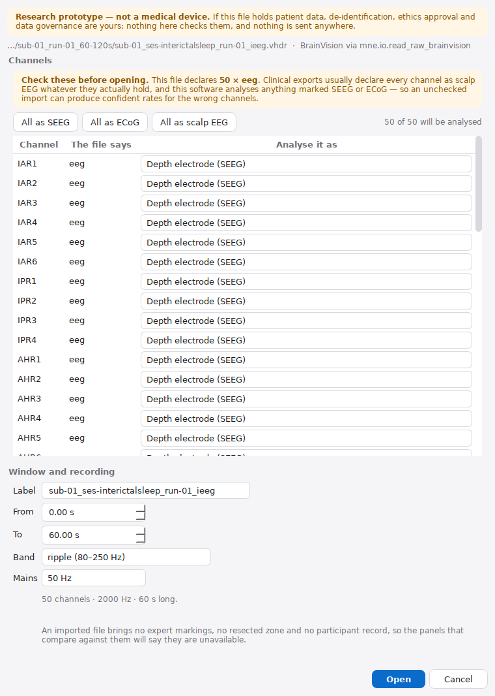

**File → Open a file…** (or the *Open a file…* button in the open dialog)
reads a recording from this machine. There is no conversion step and no
proprietary format: the file goes to one of MNE's readers and comes back as the
same recording the archive produces, so every panel, the report and the
assistant work on it unchanged.

| System | What to open |
|---|---|
| Persyst | `.lay` (the `.dat` beside it is found automatically) |
| Nihon Kohden | `.eeg` |
| Nicolet | `.data` |
| Micromed, Natus, most clinical exports | `.edf` / `.bdf` / `.gdf` |
| BrainVision | `.vhdr` — the header, not the `.eeg` |
| Blackrock | `.ns3` / `.ns5` |
| MEF3 | any file inside the `.mefd` bundle |
| Neuralynx | any `.ncs` in the recording's folder |
| Curry, EEGLAB, EGI, Neuroscan, Eximia, MNE | `.cdt`, `.set`, `.mff`, `.cnt`, `.nxe`, `.fif` |

`.eeg` is the one ambiguous extension: BrainVision writes the *signal* to
it beside a `.vhdr` header, Nihon Kohden writes the whole recording to it.
A sibling `.vhdr` settles which, so either file of a BrainVision triplet
opens the right one. Anything MNE reads that is missing from this list is
one line in `onset_hfo/io.py`; a Nicolet `.data` needs its channel type
supplied, because its header does not carry one.

### The screen that matters is the channel list

A clinical export almost always declares **every channel as scalp EEG**,
whatever is actually in it — the one real intracranial BrainVision file this
project caches declares all fifty that way. This software analyses anything
typed SEEG, ECoG or scalp EEG and drops the rest, so a file taken at its word
produces a complete review — rates, Poisson intervals, a candidate channel set
— for the EKG lead and the DC channels as readily as for a depth electrode, and
nothing anywhere says so.

So the dialog shows you what the file claims, next to what it will be analysed
as, and will not open until something is marked SEEG or ECoG. Set them all with
one of the three buttons, then change the exceptions — the EKG, the DC
channels, the trigger — individually. The count beside the buttons is the
number that will actually be analysed.

### What else it asks, and why

* **From / To.** Only this window is read. A night of intracranial EEG is tens
  of gigabytes and this software analyses a minute of it; the range is bounded
  by the file's own length. Every time it later reports is a time in the
  original recording, not in your window.
* **Band.** Offered from the file's sampling rate, so the fast-ripple band
  disappears below 1000 Hz for the same reason it does for the archive.
* **Mains.** 50 or 60 Hz, and it is *not* read from the file. Notching the
  wrong one leaves the interference in place and carves a hole where there was
  none, and it never announces itself.
* **Label.** Goes on the report. Use a study code, not a patient name.

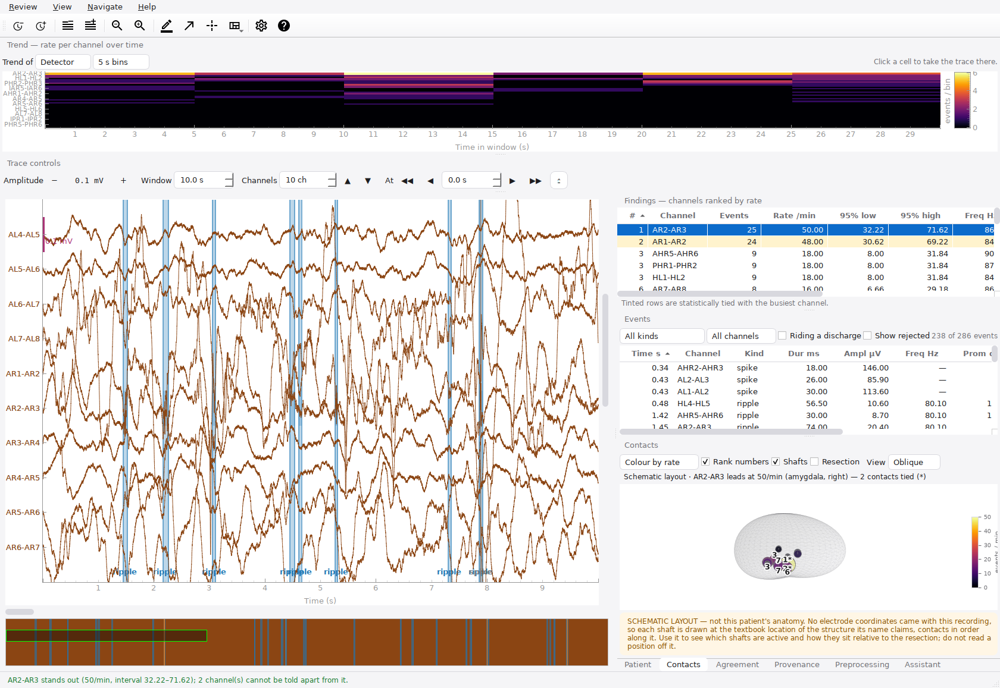

### What an imported file does not bring

No expert markings, no resected zone, no participant record. *Detector vs
expert* and the resection overlay say they are unavailable rather than showing
an empty table, and **Patient** says the record does not exist rather than that
none was found. The contacts view still places shafts from their names, with
the same warning it always carries.

**Nothing is uploaded anywhere.** Equally, nothing here checks
de-identification, ethics approval or data governance — those remain yours.

### From a script

The window route asks for the channel types; a scripted one has to state them:

```bash
onset-review --open /data/study-001.edf              --all-channels-as seeg --channel-type 'EKG=ecg'              --window 0 60 --subject study-001              --export reviews/study-001.md
```

Without `--all-channels-as` or `--channel-type` it refuses and says why. That
refusal is deliberate: a batch run that trusted the file's own answer is the
one way to produce a folder of confident reviews of the wrong channels.

---

## 6. What this has actually been measured to do

Cohort figures from [`EVALUATION.md`](EVALUATION.md), 20 patients, against the
annotators' 41,187 marked events, on reviewed channels only.

**Ripple band, individual events.** At 2.0 SD the detector agrees with about
half of what it marks (precision 0.51) and finds about a third of what the
annotators marked (recall 0.38). Raising the threshold to 5.0 SD buys precision
0.59 and costs recall — 0.12.

**Fast ripple band.** Much harder. At 2.0 SD precision is 0.086: eleven
detections for every real one. It takes 5.0 SD to reach precision 0.54.

**Ranking channels is easier than marking events,** which is the useful part:
the detector's channel ordering correlates with the annotators' at ρ ≈ 0.65
(ripples, 2.0 SD) even where individual-event agreement is poor. If what you
want is "which channels", that is a better-supported question than "which
events".

**Against surgical outcome** — the one comparison whose reference standard is
not another opinion — see [`OUTCOME.md`](OUTCOME.md). On the whole recording,
the channel with the most expert-marked fast ripples was inside the resection
in 11 of 13 patients who became seizure-free and 3 of 7 whose seizures
returned: **AUC 0.71, p = 0.12**. Our detector, same channels: 10 of 13 versus
3 of 7, AUC 0.67, p = 0.17. **Neither is significant.** An earlier version of
this analysis, on the first minute only, gave AUC 0.82 and p = 0.007, and that
number was wrong in the sense that matters: it does not survive looking at the
other four minutes of the same recordings. Two patients accounted for the whole
difference.

That history is in the documentation on purpose. It is the clearest statement
available of how much a twenty-patient study with a binary per-patient metric
can move, and it is why this interface insists on confidence intervals,
candidate sets and a second window.

---

## 7. The five things never to conclude from this screen

1. **"The busiest channel is the seizure onset zone."** It is the busiest
   channel in one minute of one recording, by one detector, at one threshold.
   Whether that tracks the onset zone is the open question the field has not
   settled; on this cohort the association did not reach significance.

2. **"No channel stands out, so there is nothing here."** The status bar says
   the *ordering* is not supported by this window. A longer window, a different
   night, or a different band may well order it. Absence of a leader is not
   absence of disease.

3. **"The detector agrees with the expert, so it is right."** The annotators
   are the available reference standard, not the truth. Two experts marking the
   same minute disagree substantially. Agreement with one of them bounds how
   well a detector *could* be doing; it does not establish it.

4. **"The 3D view shows where the electrodes are."** It shows where electrodes
   *with those names* conventionally go. No dataset this software currently
   reads contains a measured coordinate for any contact. The view is for
   adjacency and for the relationship to the resection, not for geometry.

5. **"This tells me what to resect."** It does not. No part of this software
   has been validated against a surgical decision, the cohort is twenty
   patients, five of whom have only a quarter of their resected contacts
   present in the recording at all, and the one outcome comparison it has been
   through did not separate the groups. [`LIMITATIONS.md`](LIMITATIONS.md) is
   the full list and is shorter than this guide.

---

## Where to go next

* [`INSTALL.md`](INSTALL.md) — installing it, and what to do when it will not start
* [`DATA.md`](DATA.md) — the recordings: where they come from, what the
  annotations mean, and how to point the loader at your own data
* [`METHODS.md`](METHODS.md) — every algorithm and threshold, with the paper
  each came from
* [`EVALUATION.md`](EVALUATION.md) — everything that has been measured
* [`LIMITATIONS.md`](LIMITATIONS.md) — **read before quoting any number from
  this software to anyone**
