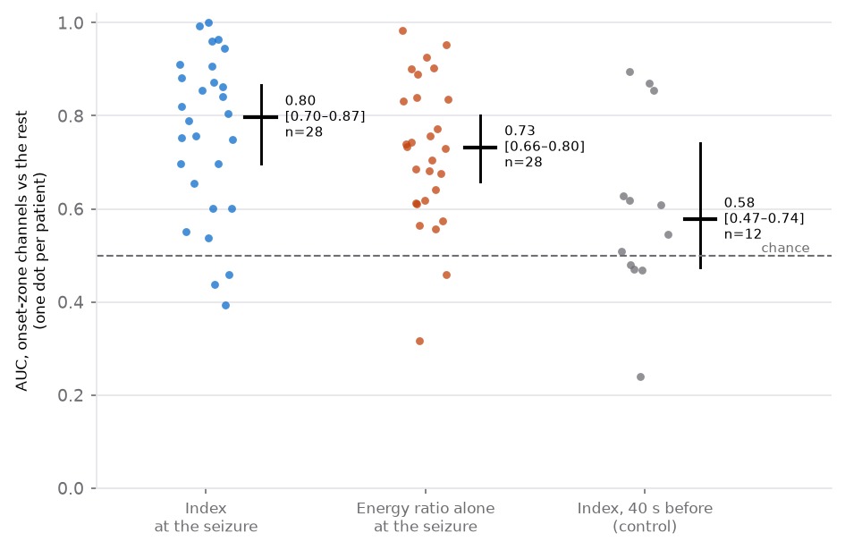

# Does the Epileptogenicity Index find the clinicians' onset zone?

The case window's **Ictal onset** step ranks channels by the
Epileptogenicity Index (Bartolomei, Chauvel & Wendling, *Brain* 2008;
`onset_hfo/ictal.py`, explained in the clinical guide §5a). This is the test
of it on public data: OpenNeuro `ds003029`, the archive whose clinicians
marked each patient's seizure onset zone, against which every channel's
index is scored.

Run it:

```bash
python -m onset_hfo.ictal_study artifacts/results/ictal_ds003029             # the study (~40 min)
python -m onset_hfo.ictal_study artifacts/results/ictal_ds003029_control 40  # the control
```

The tables are committed to [`data/ictal/`](../data/ictal), so every number
here can be checked from a fresh clone with no download.

---

## The headline

**On 28 patients the index separates the clinicians' onset-zone channels
from the rest: median per-patient AUC 0.80 (95% bootstrap interval
0.70–0.87), above 0.5 in 25 of 28.** On the same method moved 40 s
earlier, into recording with no seizure in it, the agreement mostly goes:
on the 27 seizures where that control could be run, 0.81 at the seizure
against 0.52 before it, higher at the seizure in 23 of 27 (Wilcoxon signed-rank
p = 0.0001). So the agreement comes from the seizure, not from something
the zone's channels do all the time.

Three things temper it:

1. **The timing adds little that this study can see.** The energy ratio
   alone, after the change and without the index's weighting by how early
   it came, scores 0.73 (0.66–0.80). The index is higher in 17 of 28
   patients, by a median 0.02 (p = 0.15). Most of the separation is
   "these channels went fast", not "these channels went first".
2. **The top channel is in the zone in 15 of 28 patients.** The index
   ranks the zone well as a set; its single highest channel is a coin
   toss more often than a clinician would like.
3. **The reference is not independent of the method.** The clinicians drew
   the zone with everything they had, including reading these seizures'
   onsets by eye. Agreement with them is agreement with a careful reading
   of the same signal, not with an outcome. The seizure-free patients,
   whose zone was removed and who stopped having seizures, are the
   nearest thing to ground truth here: 0.83 (0.65–0.88), n = 18.



*One dot per patient: the AUC of the onset-zone channels against the rest,
from the median index over their seizures. Bars: median and 95% bootstrap
interval. The control's 12 patients are those with enough recording before
the seizure for it.*

---

## What was done

**Patients.** Every subject of `ds003029` with a clinician-marked onset zone
in the archive's `sourcedata/clinical_data_summary.xlsx` (read by
`onset_hfo.cohort`): 32. Three subjects have no marked zone and are
left out (jh106, ummc001, ummc007). Up to three ictal runs per patient, each
holding one seizure.

**The onset.** Read from the run's own `events.tsv`
(`onset_hfo.datasets._seizure_times`). The archive rarely says what kind of
onset it marked: of the 73 analysed, 6 are labelled electrographic, 16 are a
pushbutton, and 51 are unspecified. This matters (§ "The marks").

**The signal.** 35 s either side of the onset, the project's default
preprocessing (1 Hz high-pass, mains notch and harmonics, bipolar montage on
each electrode), the same as the case window uses by default.

**The index.** As in `onset_hfo.ictal.IctalSettings`, unchanged for the study:
the energy at 12.4–97 Hz over 3.5–12.4 Hz in 1 s windows every 0.25 s,
divided by the channel's median from 30 to 5 s before the onset; Page–Hinkley
bias 0.5, threshold 15, looked for from 10 s before to 30 s after the
onset; index over 5 s, tau 1 s. No setting was tuned on this data.

**The zone.** A bipolar channel counts as onset zone when either of its two
contacts is one. A median 20% of a seizure's channels are in the zone.

**The scores.** Per seizure: the AUC of the index for the zone's channels
(Mann–Whitney, ties counted half), the same for the energy ratio after the
change, and whether the top channel is in the zone. Per patient: the median
index of each channel over their seizures, then the same. Across patients:
the median with a bootstrap interval (patients resampled, 10,000 times), the
share above 0.5, and a Wilcoxon signed-rank test against 0.5.

**The control.** The same seizures, the same code, with the "onset" put
40 s before the real one, so that the whole 70 s analysed ends 5 s before the
seizure. It needs 75 s of recording before the onset, which 27 of the 73
seizures (12 patients) have; the others are left out of it, not imputed.

---

## Results

### At the seizure

| | n | median AUC | 95% interval | above 0.5 | Wilcoxon p vs 0.5 |
|---|---:|---:|---:|---:|---:|
| index, per patient | 28 | **0.80** | 0.70–0.87 | 25 of 28 | 7 × 10⁻⁷ |
| energy ratio alone, per patient | 28 | 0.73 | 0.66–0.80 | 26 of 28 | 5 × 10⁻⁷ |
| index, seizure-free patients | 18 | 0.83 | 0.65–0.88 | 16 of 18 | 0.0002 |
| index, not seizure-free | 8 | 0.78 | 0.60–0.97 | 7 of 8 | 0.016 |
| index, per seizure | 73 | 0.74 | 0.71–0.81 | 66 of 73 | 4 × 10⁻¹² |

Two patients have no recorded outcome, which is why 18 and 8 do not add to
28. The per-seizure row counts seizures of the same patient as separate,
which they are not; it is there for the spread, and its p-value overstates.

By site, per patient: NIH 0.86 (0.70–0.94, n = 14), UMMC 0.75 (0.55–0.91,
n = 7), JHH 0.73 (0.63–0.82, n = 6), UMF 0.82 (one patient). No site is
near chance; the intervals are wide and overlap.

### The control

| | n | median AUC | 95% interval | above 0.5 |
|---|---:|---:|---:|---:|
| index at the seizure, the control's seizures | 27 seizures | 0.81 | 0.74–0.89 | |
| index 40 s before, the same seizures | 27 seizures | **0.52** | 0.47–0.61 | 15 of 27 |
| index at the seizure, the control's patients | 12 | 0.87 | 0.65–0.95 | |
| index 40 s before, the same patients | 12 | 0.58 | 0.47–0.74 | 8 of 12 |

Paired, the seizure beats the control in 23 of 27 seizures (p = 0.0001) and
10 of 12 patients (p = 0.034). Before the seizure, the change test fires on a
median 28% of channels; at the seizure, on 57%.

The control is not flat at 0.5 for every patient: three (pt3, pt6, pt16)
score 0.86–0.90 before the seizure. Something on those patients' zone
channels was already rising 40 s out — pre-ictal change, interictal
discharges clustering before the seizure, or an earlier onset than the mark.
With 12 patients this study cannot say which.

### The marks

In 53 of 73 seizures the top channel's change is dated **before** the
archive's onset mark, by a median of 5 s; the first change on any channel,
by a median of 6.5 s. Either the marks lag the electrographic onset (a
pushbutton or a clinical onset would), or the change test picks up the
build-up. Either way it puts part of the seizure inside the baseline, which
can only weaken the index. Per kind of mark, per seizure: electrographic
0.75 (0.58–0.89, n = 6), pushbutton 0.71 (0.66–0.77, n = 16), unspecified
0.78 (0.71–0.86, n = 51) — no clear difference, and the electrographic
group is too small to say more.

**In the case window this is why a person marks the electrographic onset:**
the method is only as good as the time it is anchored to.

---

## A second archive: HUP (ds004100)

The same index, with the same settings and no tuning, on the HUP archive
(OpenNeuro `ds004100`):

- the onset zone is the contacts the archive's own `channels.tsv` marks;
- the onset is its electrographic onset mark;
- up to three seizures per patient were used;
- only the EDF records around each seizure were fetched (`onset_hfo/hup.py`).

The tables are in [`data/hup/`](../data/hup).

| | patients | median AUC (95% interval) | above 0.5 |
|---|---:|---|---:|
| at the seizure | 54 | **0.79 (0.72–0.85)** | 80% |
| energy ratio alone, same seizures | 54 | 0.74 (0.67–0.79) | 89% |
| seizure-free patients | 36 | 0.79 (0.71–0.88) | 78% |
| not seizure-free | 18 | 0.80 (0.64–0.86) | 83% |
| SEEG | 34 | 0.82 (0.76–0.86) | 82% |
| ECoG | 20 | 0.73 (0.59–0.86) | 75% |
| **40 s before the seizure (control)** | 54 | **0.55 (0.52–0.60)** | 65% |

151 seizures from 55 patients were analysed. Five seizures of one patient
(HUP132) had no onset-zone contacts marked. One patient's marked contacts
(HUP112) matched none of the analysed bipolar channels, so their AUC is
undefined. Per seizure, the median is 0.78 (0.74–0.81, 148 seizures). The top
channel is in the zone in 24 of 55 patients at the seizure, and in 8 of 55 in
the control.

**It replicates.** On ds003029 the index gave 0.80 at the seizure and 0.52
in the control; on HUP it gives 0.79 and 0.55. The single top channel is
again a weaker statement than the ranking of the zone as a set. As on
ds003029, outcome makes little difference.

---

## What did not get analysed

| | seizures | patients | why |
|---|---:|---:|---|
| archive file shorter than its header | 4 | 4 (umf002–005) | the `.eeg` on the archive is 0.2–0.7 MB where the header and the run's length imply 48–128 MB; the byte range around the onset does not exist |
| no onset mark in the run's events | 2 | pt17 (1 of 3 kept) | |
| onset under 35 s into the run | 4 | ummc002, ummc004, ummc006 (other runs kept) | too little before it for the baseline |

73 of 83 seizures tried were analysed, from 28 of the 32 patients with a
marked zone.

---

## What this does and does not support

- **Supported:** on this archive, with no tuning, the index ranks the
  clinicians' onset-zone channels above the rest in most patients, and the
  ranking depends on the seizure being in the analysed stretch.
- **Not supported:** that the index adds much to the plain energy ratio
  here; that its top channel alone is the onset zone; that it predicts
  surgical outcome (the zone's agreement is about as good in patients whose
  surgery failed as in those it cured, 0.78 against 0.83, intervals
  overlapping); anything about other archives, montages or sampling rates.
- **Not tested:** how it compares with a clinician reading the same
  seizures blind, which is the comparison that would matter in practice.

These are 28 patients from four centres, with the archive's own onset marks.
The intervals are the honest size of what is known.
