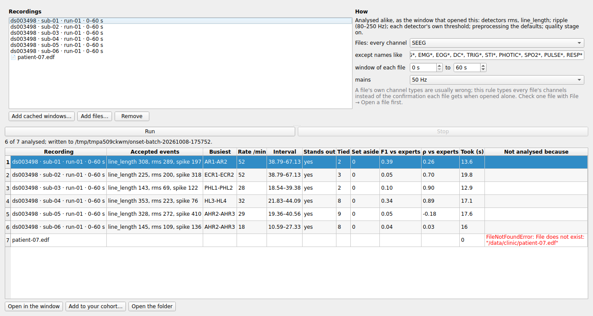
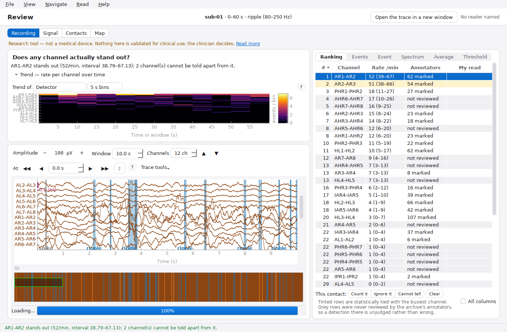
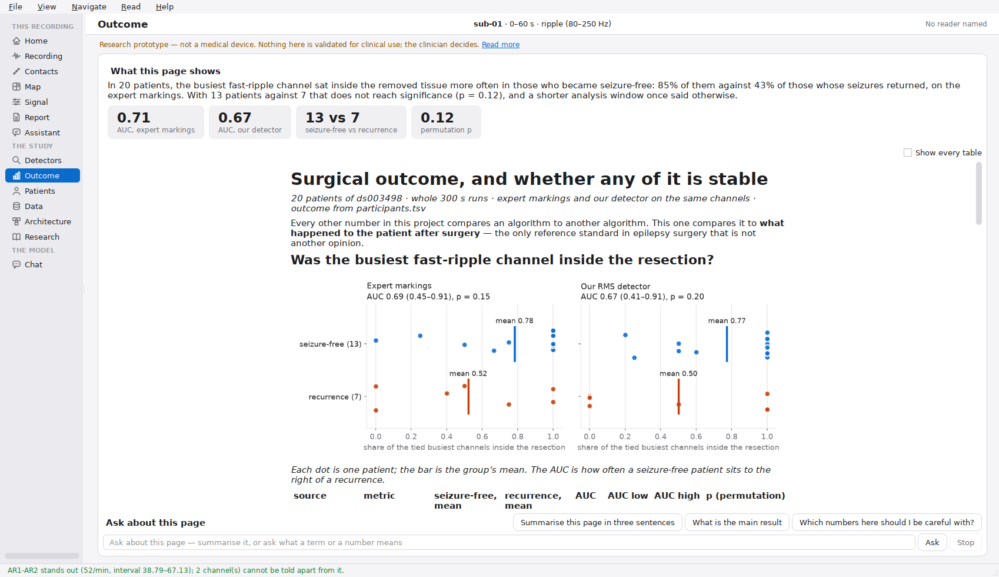
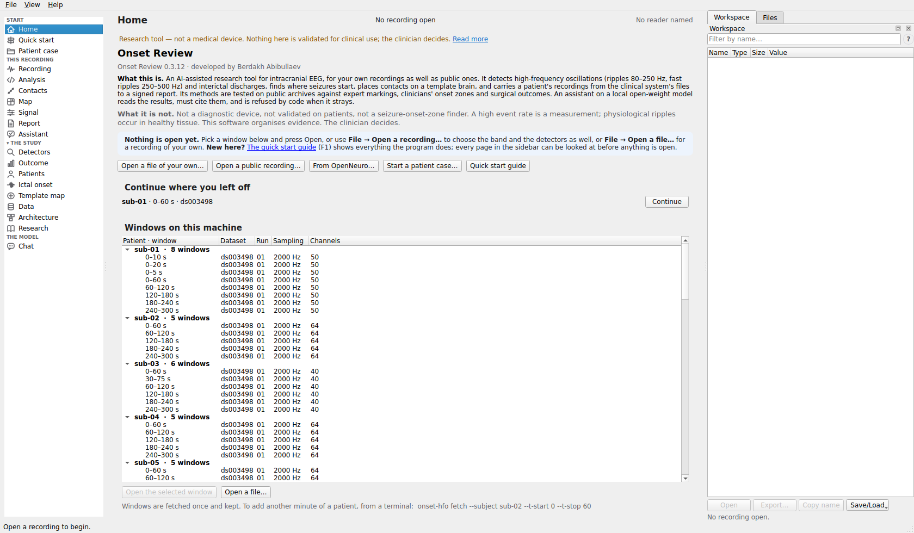

# Installing Onset Review on Ubuntu

**Onset Review** is the desktop application: a window with an iEEG trace in it,
the detector's marks on the signal, the archive annotators' marks beside them,
and the tables that say whether any of it means anything. It is the same
pipeline the rest of this repository documents, with a face on it.

> **Research prototype — not a medical device.** Not CE-marked, not FDA-cleared,
> and never validated for clinical use. It reads public research recordings.
> Read [`LIMITATIONS.md`](LIMITATIONS.md) before quoting any number it shows.

Tested on Ubuntu 22.04 and 24.04, X11 and Wayland. It needs Python 3.10 or
newer and about 1.5 GB of disk for the environment.

---

## The short version

```bash
git clone https://github.com/berdakh/onset-hfo.git
cd onset-hfo
./packaging/install-ubuntu.sh --with-sample
onset-review
```

That installs the Qt libraries (one `sudo apt-get`), builds a virtual
environment under `~/.local/share/onset-review`, puts `onset-review` on your
PATH and an entry in the applications menu, and fetches one minute of one
patient so the first launch has something to open.

Drop `--with-sample` on a machine with no internet; everything else works, and
[**Getting a recording**](#getting-a-recording) covers how to add one later.

To remove it again:

```bash
./packaging/install-ubuntu.sh --uninstall
```

That removes the environment, the command and the menu entry. It leaves the
apt packages and any recordings you cached, both of which are shared with the
rest of the project.

---

## What the installer does, in case you would rather do it yourself

```bash
# 1. the libraries Qt needs. On a desktop install most are already there; on a
#    server or a container none of them are, and the symptom is the unhelpful
#    "could not load the Qt platform plugin xcb".
sudo apt-get install -y python3-venv python3-pip \
  libegl1 libgl1 libglib2.0-0 libxkbcommon-x11-0 libxcb-cursor0 \
  libxcb-icccm4 libxcb-keysyms1 libxcb-shape0 libxcb-xinerama0 \
  libxcb-randr0 libxcb-render-util0 libdbus-1-3 libfontconfig1 libfreetype6

# 2. an environment of its own, so nothing touches the system Python
python3 -m venv ~/.local/share/onset-review/venv
source ~/.local/share/onset-review/venv/bin/activate

# 3. the package, with the desktop extra
pip install -e ".[review]"

# 4. check Qt can start before worrying about anything else
QT_QPA_PLATFORM=offscreen python -c \
  'from qtpy.QtWidgets import QApplication; QApplication([]); print("Qt ok")'
```

The `review` extra pulls in **PySide6-Essentials** (Qt itself, without the
WebEngine/3D/Multimedia modules a trace viewer never touches),
**mne-qt-browser** (the signal viewer the window is built around) and
**pyqtgraph** (the trend panel).

---

## Getting a recording

Onset Review opens windows that are already on disk and refuses to reach for
the network unless told to. That is deliberate: a reviewer should never
discover halfway through a click that the software wants 700 MB from
OpenNeuro over a hospital connection.

See what you have:

```bash
onset-review --list
```

Add a minute of a patient (needs internet, downloads a few MB, not the whole
dataset):

```bash
python -m onset_hfo.cli fetch --subject sub-01 --t-start 0 --t-stop 60
```

`sub-01` … `sub-20` are the twenty patients of OpenNeuro
[`ds003498`](https://openneuro.org/datasets/ds003498): interictal slow-wave
sleep, 2000 Hz, with the annotators' own HFO markings, the contacts the surgeon
removed, and whether the patient became seizure-free. Those markings are what
makes this dataset worth learning on — see [`DATA.md`](DATA.md).

Everything is cached under `artifacts/data/`, so a window is fetched once.

### Or a recording of your own

**File → Open a file…**, or the *Open a file…* button in the open dialog,
reads a file from this machine through MNE's readers — EDF, BDF, GDF,
BrainVision, Persyst, Nihon Kohden, Nicolet, Curry, Blackrock, Neuralynx,
MEF3, EEGLAB, EGI, Neuroscan, Eximia, FIF. There is no conversion step and no
proprietary format; the file becomes the same recording the archive produces,
and every panel works on it unchanged.

You will be asked to confirm which channels are intracranial before anything is
analysed, and the dialog will not open the file until something is marked SEEG
or ECoG. That is not a formality: a clinical export declares every channel as
scalp EEG — including the real intracranial BrainVision file this project
caches — and this software analyses whatever is typed eeg, ecog or seeg. See
[`CLINICAL_GUIDE.md` §5](CLINICAL_GUIDE.md).

Nothing is uploaded anywhere. Nothing here checks de-identification, ethics
approval or data governance either; those stay yours.

---

### Or a patient's whole monitoring, as a case

**File → New case…** makes a case: a folder, a pseudonym, then the clinical
system's files converted into it one by one (BIDS-iEEG; EDF/EDF+, BDF,
BrainVision, Nihon Kohden, Nicolet, Persyst, Blackrock, Neuralynx, MEF3,
EEGLAB; Micromed with `pip install neo`; Natus from its EDF+ export). Nothing
that names the patient is written. The case window then takes the channels
and the marks — hours at a glance, MNE's browser to mark seizures, sleep and
artefacts — and opens any minute in the review window. `onset-review
/path/to/case` opens a case from the terminal. The clinical guide's section
5a has the whole of it.

## Starting it

| | |
|---|---|
| From the applications menu | search for **Onset Review** |
| From a terminal | `onset-review` |
| Straight into a patient | `onset-review --subject sub-01 --window 0 60 --expert` |
| Straight into your own file | `onset-review --open /data/study-001.edf` |
| Every option | `onset-review --help` |

`onset-review` on its own opens the window first, on **Home**, with nothing
loaded. The data comes from inside it: pick a cached window on Home and press
*Open*, or **File → Open a recording…** for the dialog below with the band,
the detectors and the threshold, or **File → Open a file…** for a recording of
your own. The other pages wake up once something is open.


The dialog lists only the windows you have cached, and offers only the bands
the recording's sampling rate can actually support — the fast-ripple band is
greyed out on a 1000 Hz recording, because a 500 Hz band on a 500 Hz Nyquist
is not a conservative analysis, it is a meaningless one.

### The window is a sidebar of pages

The window has the shape of the results site: a sidebar on the left, one page
at a time on the right, and the same disclaimer on every page: one line, the
whole of it a click on *Read more* away. The sidebar is a source list, a
glyph beside each page; hover one for what it is for. Above the page a
toolbar names it, says which recording is open (subject, window, band), and
carries the page's own buttons and the reader's name. Panels sit on cards.

| page | what is on it |
|---|---|
| **Home** | what this is and is not; before anything is open, *Continue where you left off* with the window opened last time; the windows cached on this machine grouped by patient (double-click one to open it), *Open a file…*. What each page is for is under **Help → How to read the pages** |
| **Recording** | *Does any channel actually stand out?*, the trend strip, the trace, and a side column with the ranking, the events, the selected event close up and, on tabs beside it, every channel's spectrum, a channel's events averaged, and the leaders re-tested at stricter thresholds. *Open the trace in a new window*, in the toolbar (`Ctrl+Shift+T`), lifts MNE's browser into a window of its own, for a second monitor; closing that window puts it back. The row above the trace is the only toolbar on it: MNE's own bar, which repeats that row, is hidden while the trace is on the page, and what it alone offers (annotation mode, the crosshair, the overview bar, MNE's settings and help) sits under *Trace tools* at the row's end |
| **Contacts** | the 3D view, the patient record, where the coordinates came from, and the button that fetches MNE's `fsaverage` template brain (a few hundred megabytes, once) for the 3D view to draw under measured coordinates |
| **Signal** | data quality and preprocessing side by side, the preprocessing as groups of settings rows — filter design, reference, muscle and amplitude marking, reference regression and an experimental ICA among them — provenance and the ICA components under them; *Apply* re-runs the analysis and every page follows |
| **Report** | the review as it will be exported, the findings paragraph (yours, or drafted by the assistant and marked as such), agreement with the archive's annotators, *Export review…* in the toolbar |
| **Assistant** | the assistant, one card per exchange with a chip saying what the answer is (Checked, From the documents, Not checked, Refused) and the trace folded under it; a *Stop* button for a model taking too long, *New conversation*, the tick that lets it run the pipeline's analyses, and the box that gets a local Qwen onto this machine. A refusal says what the model wrote and which check it failed |
| **Chat** | under *The model*: the same local model on its own, not connected to the recording and checked by nothing, with a line at the top that says so. There before a recording is opened |

`Alt+1` to `Alt+9` switch pages, so do the entries at the top of **View**.
Every boundary between regions — the sidebar and the page, the trend strip
and the trace, the trace and its side column, the 3D view and its column, and
so on — is a splitter you drag with the mouse. Sizes are remembered across
re-analyses and across launches; **View → Restore the default layout** puts
them back.

Two **panes** sit beside the pages, as Spyder's do: **Workspace**, every
variable the open window holds — the signal, the events, the ranking, the
quality tables, the request — with its type, size and a glimpse of its value,
and **Files**, the current folder. Double-click a variable to open it in a
window of its own: a table for tables, the channels × samples array with
times along the top, a tree for the request and your read. Open as many as
you like and drag them where you want them; *Export…* writes a copy (.csv,
.npy or .json) to the current folder. In Files, double-click a folder to go
in and a recording to open it, through the same import dialog as *File → Open
a file…*. Each pane can be dragged to any edge of the window, tabbed with the
other or apart, floated as a window of its own, or closed; **View → Workspace**
(`Ctrl+Shift+W`) and **View → Files** (`Ctrl+Shift+F`) bring them back, and
the arrangement is remembered. On a screen narrower than 1600 px a loaded
window starts with them hidden, and a pane shown there opens as its own
window: beside the Recording page on a 1366 px laptop there is no room.


A third pane, **Console** (`Ctrl+Shift+I`), is Python in the window's own
memory, as Spyder's IPython console: `session`, `raw`, `events`, `findings`,
`request`, `read` and `recording` are the open window's objects, not copies,
and `np`, `pd`, `mne`, `plt` and `onset_hfo` are imported. Run your own
analysis on the signal on screen — `raw.get_data()` is it, in volts — and what
you make appears in the Workspace under *Console*. A figure a command draws
opens in a window of its own. The console's working directory is the Files
pane's folder, and an `os.chdir` or `%cd` moves the Files pane with it. It
sits under the Workspace in the same column, closed until asked for, and it
keeps what you made in it when the window is re-analysed or another recording
is opened.

Two things to know. A long computation runs in the window's own thread: a
strip above the prompt counts the seconds, and **Stop** (or `Esc`) interrupts
it as `Ctrl+C` does — the rest of the window waits for it, and one long call
inside a library finishes first. And the console can change the objects the
panels and the report are built from, so every command run in a window is
listed, in order, under *Python console* in the exported report. The full
IPython console needs `qtconsole`, which the installer brings; without it the
pane is a plain Python console that says what to install.


**The Analysis page.** Under Recording in the sidebar, the Workspace, Files
and Console come onto one page beside an **Editor** of scripts and notebooks,
as in Spyder, and go back to their docks when you leave it. Every Workspace
name is the same object in the console (`signal` is the samples, read-only).
`Ctrl+Enter` runs the cell under the cursor (cells start at `# %%`),
`Shift+Enter` runs it and moves on, `F9` the selection, `F5` the file. A
notebook opens as cells and saves back as a notebook. **Write code** asks the
local model to draft Python from a sentence: it is told the Workspace's names,
types and columns, never the data, and the draft opens in its own tab with
what could be checked — that it parses, any name that does not exist, any call
that deletes files or uses the network. Nothing runs it but you. The
Workspace's *Save/Load* keeps the console's variables as `.pkl`, `.npz` or
`.mat`. Two more tabs sit beside the Workspace and Files on this page:
**Plots**, where every figure the console or the editor draws collects (open
one in a window, save it as PNG, PDF or SVG), and **History**, every command
run in the console, searchable, any of which goes to the editor with a
double-click.


**Many recordings, and projects.** *File → Analyse many recordings…*
(`Ctrl+Shift+A`) analyses a list of cached windows and files of your own one
after another, alike, into one table with a row each — files typed by one
rule you state, failures kept as rows with their reason — and any row can join
*Your cohort*. *File → Save project…* (`Ctrl+Shift+S`) keeps a recording and
everything done with it — settings, verdicts, scripts, console variables,
cohort — in one `.onsetproj` file that *File → Open project…* (or
`onset-review study.onsetproj`) reopens here or on another machine, analysing
the recording again from its request. The batch window's **Across the batch**
tab draws each recording's busiest channel with its interval on one chart,
each detector's agreement with the experts across the recordings that have
markings, and names any recording that differs from the rest (more than 3.5
robust z from the batch's median, with five or more recordings). *Open a
batch…* brings back a batch run before, with rows that open as they did.
*File → Compare with* lines the window up with the same recording under other
settings, or with a saved project: what differs, where the busiest channel
went, how far each channel moved, and the events found by both or by one.



**Keeping the screen clear.** The View menu has what is needed when the panes
and their windows crowd the page:

| View entry | what it does |
|---|---|
| **Workspace**, **Files**, **Console** | show or hide one pane (`Ctrl+Shift+W`, `F`, `I`) |
| **Pane layout → Page only** | close every pane at once (`Ctrl+Shift+P`) |
| **Pane layout → Spyder** | Workspace and Files tabbed on the right, the Console under them |
| **Pane layout → MATLAB** | Files on the left; the Workspace on the right, the Console under it |
| **Close variable and figure windows** | every window the Workspace and the Console opened |
| **Page sidebar** | hide the list of pages to give the page its width (`Ctrl+Shift+B`); `Alt+1`… still move between pages |
| **Full screen** | the window and nothing else (`F11`) |

The layout and the sidebar are remembered for the next launch; **Restore the
default layout** brings both back. On a screen too narrow to dock the panes
beside the page, a layout opens them as windows of their own and the status
bar says so.



Under the first group sit the six **study pages** of the results site —
Detectors, Outcome, Patients, Data, Architecture, Research — built in the
window from the same committed tables the site reads (`data/`), through the
site's own loaders. They need no recording, so they are open before anything is
loaded. Each opens with **What this page shows**: two or three plain sentences
and up to four numbers, computed from the same tables as the page, for someone
who reads nothing else on it. Detectors draws the threshold sweep as one line
per detector with the chosen operating point marked, and Outcome draws every
patient as a dot by outcome, both from the tables beside them. The text sits
in a reading column; tables longer than ten rows are folded until *Show every
table* is ticked; a glossary term on the page carries its definition as a
tooltip. Under the text, **Ask about
this page** puts a question to the local model with that page as its only
material — every number in the answer must be on the page or the answer is
marked refused — and answers from the page itself when no model is loaded.
Band, metric and patient are combo boxes above the text, and the
Patients page can open a patient's cached window on the Recording page, which
is the one link the site cannot make.



With a recording open, each study page also carries a section headed **This
recording**: the open window scored against its expert markings the way the
study scored each patient, marked on the sweep (or the detectors' agreement
where there are no markings); a study patient ringed on the outcome chart.
**Explore the chart** opens the figure live — hover, click a patient to open
them, drag the threshold. **Re-run with your settings** runs the Detectors or
Outcome study again with your choices, in the background, and shows it dashed
beside the published lines, labelled yours. **Add this recording to your
cohort** measures your own patients the same way. **Open as notebook** opens the
page as a notebook that rebuilds it. None of it changes a published number.

They read the checkout, or the release
bundle's `site/` folder, which `install.sh` copies next to the environment; on
an install with neither the pages say so and point at the
[results site](https://berdakh.github.io/onset-hfo/).



The original arrangement, every panel a dock on the trace's window with three
task layouts, is still there: **View → Everything at once (docked panels)**
rebuilds the window that way, **View → Pages (sidebar)** comes back, and
`onset-review --layout docks` opens in it. Nothing is lost either way: both
arrangements are the same panels, wired the same way.

Without a display at all — over SSH, or in a batch — the review still produces
its document:

```bash
onset-review --subject sub-01 --window 0 60 --export review.md
```

The same for a file of your own — except that with no dialog to confirm them,
the channel types have to be stated, and it refuses rather than guessing:

```bash
onset-review --open /data/study-001.edf \
             --all-channels-as seeg --channel-type 'EKG=ecg' \
             --window 0 60 --subject study-001 --export review.md
```

---

## The assistant, with a real model

The reviewer's assistant panel runs an open-weight Qwen that can only quote the
window on screen (see [`AGENT.md`](AGENT.md)). One flag sets it up:

```bash
./packaging/install-ubuntu.sh --with-assistant        # or add it to an existing install:
./packaging/install-ubuntu.sh --with-assistant --skip-install
```

Or do it from inside the window: the **Assistant** page has a box that looks
at this machine, lists every Qwen size it can serve, and offers to pull the
one you pick with a progress bar. On a CPU it opens on the 3B
(`qwen2.5:3b-instruct`, about 1.9 GB), which answers in well under a minute;
the 7B the installer picks is more careful and several times slower. It needs
Ollama running first (`ollama serve`); it cannot install a daemon. Once
pulled, the model is written as the default and the assistant switches to it
on the spot.

That installs [Ollama](https://ollama.com) if it is missing (its official
script, one `sudo`), gives the service an **8192-token context** — the agent's
opening turn is a few thousand tokens and Ollama's default of 2048 rejects it
before the first answer — picks the Qwen that suits this machine (the same
choice `onset-agent --hardware` prints: a 7B as a 4.6 GB Q4 file on a 16 GB
laptop), pulls it once, and records the choice so the panel **opens on it**
rather than on "No model". Use `--assistant-model qwen3:8b` to choose yourself,
`--no-pull` to defer the download, and `--dry-run` to see the plan first.

Why Ollama rather than running the model inside Python: on a machine without an
NVIDIA card, `transformers` loads float32 — twice the memory and a fraction of
the speed of the same model as a Q4 GGUF — and needs two gigabytes of torch to do
it. Ollama runs the quantised model on CPU or GPU alike. The in-process route is
still there for anyone who wants it: `pip install 'onset-hfo[llm]'` and
`--backend transformers`.

If your Ollama listens somewhere other than `127.0.0.1:11434`, set
`OLLAMA_HOST` the way Ollama itself reads it (`host:port`, or a URL); the
installer, `onset-agent --backend auto` and the reviewer's panel all follow it.

Any OpenAI-compatible server (vLLM, llama.cpp's `llama-server`, LM Studio)
works too: pick **OpenAI-compatible server** in the panel and give it the URL —
and give *that* server a context of at least 4096 as well (`-c 8192` for
llama.cpp, `--max-model-len` for vLLM).

Whatever the model, every number it states is checked against what the tools
returned, and an answer that fails the check is replaced by a refusal — see
[`AGENT.md`](AGENT.md) for the threat model. Asking it what to resect gets a
refusal before the model is even called.

### A release bundle instead of a checkout

Every release on <https://github.com/berdakh/onset-hfo/releases> carries
`onset-hfo-<version>-linux.tar.gz`. It holds the wheel, this installer as
`install.sh`, the menu entry and icon, these docs, and the `site/` folder the
study pages read. No git, no checkout:

```bash
tar xzf onset-hfo-<version>-linux.tar.gz
cd onset-hfo-<version>-linux
./install.sh --with-sample --with-assistant
```

The installer sees the wheel beside it and installs that. To build the same
tarball from a checkout:

```bash
./packaging/make-release.sh      # -> dist/onset-hfo-<version>-linux.tar.gz
```

## If something goes wrong

**Help → Report a problem…** shows, and saves as one zip to send, what a
developer needs: the versions of everything that matters, this machine, the
window's own log and the latest model check. The log is written as the window
runs — what was opened, every background job and how long it took or why it
was stopped, every warning and error with its traceback, Qt's complaints —
to `~/.local/state/onset-review/onset-review.log`, rotated at a megabyte; a
crash that takes the program down is written to `crash.log` beside it. The
report writes your home folder as `~` and holds no signal, but it does name
the recordings and files that were opened.

**Help → Test the local model…** measures how well the model chosen on the
Assistant page serves this software on this machine. It asks the assistant
eight questions a reviewer asks, each with what should happen — answered with
every number checked, or refused where it asks for a clinical decision — and
gives *Write code* nine requests whose drafts are run on the recording, in a
scratch folder with a time limit, and graded against the right answer ("how
many events were accepted" has one). It runs in a process of its own and
takes several minutes on a CPU; the result is saved for you to send and goes
into the next problem report. From a terminal:

```bash
python -m onset_review.modelcheck                       # the Assistant page's model
python -m onset_review.modelcheck --backend ollama --model qwen2.5:3b-instruct
```


**`could not load the Qt platform plugin "xcb"`** — a system library is
missing. Run the installer without `--no-apt`, or install the list in step 1
above. To see which library:

```bash
QT_DEBUG_PLUGINS=1 onset-review 2>&1 | grep -i "cannot load"
```

**`onset-review: command not found`** — `~/.local/bin` is not on your PATH:

```bash
echo 'export PATH="$HOME/.local/bin:$PATH"' >> ~/.bashrc && source ~/.bashrc
```

**`ImportError: The sklearn package is required to use method='fastica'`**
on Apply — an install from before 0.3.3 did not bring scikit-learn, which
MNE's FastICA solver is built on. Either re-run the installer from the
checkout, which now installs it, or add it to the app's environment:

```bash
~/.local/share/onset-review/venv/bin/pip install scikit-learn
```

Until then the Preprocessing panel offers only the `infomax` solver, which
needs nothing extra.

**"No recordings are cached yet"** — nothing has been fetched. See
[**Getting a recording**](#getting-a-recording).

**The window does not fit the screen, or has no maximise button** — it should
now do both by itself: the window opens clamped to the screen's work area, and
maximised when that was a reduction. If a dock layout you have dragged about
has pushed it wider than the screen again, **View → Fit the window to this
screen** (`Ctrl+0`) puts it back, **View → Maximise window** and **View → Full
screen** (`F11`) are there whatever your window manager does with title bars,
and **View → Restore the default layout** undoes the dragging. The window can
be made as small as 963 × 753 px; below that, panels scroll inside their docks
rather than the window growing past the screen.

**It opens but there is no trace** — check the window actually loaded:
`onset-review --list` should show the window you picked. If the recording is
there but the trace is blank, run with `MNE_BROWSER_BACKEND=qt` set explicitly;
MNE falls back to its Matplotlib browser when the Qt one cannot start, and that
one does not dock.

**Over SSH** — X11 forwarding works (`ssh -X`) but is slow for a scrolling
trace. Prefer running it on the machine with the screen, or use `--export`.

**The 3D view is empty, or says "schematic"** — it says schematic because it
is. Neither public archive ships electrode coordinates; the positions come from
the electrode names. [`CLINICAL_GUIDE.md`](CLINICAL_GUIDE.md) §2 explains what
that view does and does not support. Point the software at BIDS data with an
`electrodes.tsv` and it uses the real coordinates instead.

**"The model server rejected the request (HTTP 400, context_length_exceeded)"**
— the server's context window is too small for the agent's opening turn. The
installer's `--with-assistant` sets 8192 for the Ollama service; by hand, start
it with `OLLAMA_CONTEXT_LENGTH=8192 ollama serve`, or `-c 8192` for
`llama-server`.

**"The model could not be reached"** — Ollama is not running, or not on the
default port. `ollama serve`, then `curl http://localhost:11434/api/tags` to
check. Switch to *No model* meanwhile; everything except the generated prose
works identically.

**Running it headless anyway** (CI, or a screenshot for a talk):

```bash
QT_QPA_PLATFORM=offscreen MNE_BROWSER_BACKEND=qt \
  xvfb-run -a onset-review --subject sub-01 --window 0 60 \
  --expert --screenshot window.png
```

---

## Next

[**CLINICAL_GUIDE.md**](CLINICAL_GUIDE.md) — what the four panels mean, what
the screen supports concluding, and the four things never to conclude from it.
