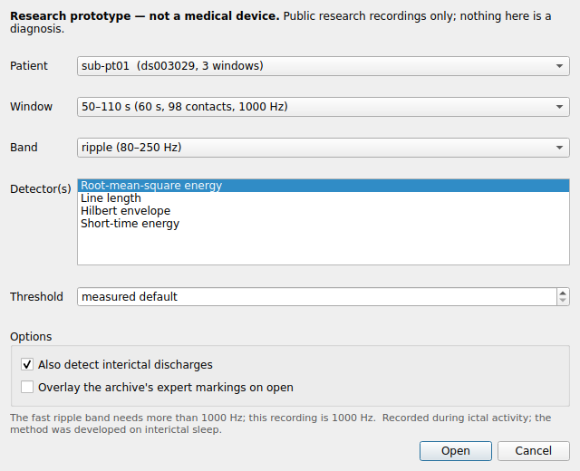

# Installing Onset Review on Ubuntu

**Onset Review** is the desktop application: a window with an iEEG trace in it,
the detector's marks on the signal, the archive annotators' marks beside them,
and the tables that say whether any of it means anything. It is the same
pipeline the rest of this repository documents, with a face on it.

> **Research prototype — not a medical device.** Not CE-marked, not FDA-cleared,
> and never validated for clinical use. It reads public research recordings.
> Read [`LIMITATIONS.md`](LIMITATIONS.md) before quoting any number it shows.

Tested on Ubuntu 22.04 and 24.04, X11 and Wayland. It needs Python 3.10 or
newer and about 1.5 GB of disk for the environment.

---

## The short version

```bash
git clone https://github.com/berdakh/onset-hfo.git
cd onset-hfo
./packaging/install-ubuntu.sh --with-sample
onset-review
```

That installs the Qt libraries (one `sudo apt-get`), builds a virtual
environment under `~/.local/share/onset-review`, puts `onset-review` on your
PATH and an entry in the applications menu, and fetches one minute of one
patient so the first launch has something to open.

Drop `--with-sample` on a machine with no internet; everything else works, and
[**Getting a recording**](#getting-a-recording) covers how to add one later.

To remove it again:

```bash
./packaging/install-ubuntu.sh --uninstall
```

That removes the environment, the command and the menu entry. It leaves the
apt packages and any recordings you cached, both of which are shared with the
rest of the project.

---

## What the installer does, in case you would rather do it yourself

```bash
# 1. the libraries Qt needs. On a desktop install most are already there; on a
#    server or a container none of them are, and the symptom is the unhelpful
#    "could not load the Qt platform plugin xcb".
sudo apt-get install -y python3-venv python3-pip \
  libegl1 libgl1 libglib2.0-0 libxkbcommon-x11-0 libxcb-cursor0 \
  libxcb-icccm4 libxcb-keysyms1 libxcb-shape0 libxcb-xinerama0 \
  libxcb-randr0 libxcb-render-util0 libdbus-1-3 libfontconfig1 libfreetype6

# 2. an environment of its own, so nothing touches the system Python
python3 -m venv ~/.local/share/onset-review/venv
source ~/.local/share/onset-review/venv/bin/activate

# 3. the package, with the desktop extra
pip install -e ".[review]"

# 4. check Qt can start before worrying about anything else
QT_QPA_PLATFORM=offscreen python -c \
  'from qtpy.QtWidgets import QApplication; QApplication([]); print("Qt ok")'
```

The `review` extra pulls in **PySide6-Essentials** (Qt itself, without the
WebEngine/3D/Multimedia modules a trace viewer never touches),
**mne-qt-browser** (the signal viewer the window is built around) and
**pyqtgraph** (the trend panel).

---

## Getting a recording

Onset Review opens windows that are already on disk and refuses to reach for
the network unless told to. That is deliberate: a reviewer should never
discover halfway through a click that the software wants 700 MB from
OpenNeuro over a hospital connection.

See what you have:

```bash
onset-review --list
```

Add a minute of a patient (needs internet, downloads a few MB, not the whole
dataset):

```bash
python -m onset_hfo.cli fetch --subject sub-01 --t-start 0 --t-stop 60
```

`sub-01` … `sub-20` are the twenty patients of OpenNeuro
[`ds003498`](https://openneuro.org/datasets/ds003498): interictal slow-wave
sleep, 2000 Hz, with the annotators' own HFO markings, the contacts the surgeon
removed, and whether the patient became seizure-free. Those markings are what
makes this dataset worth learning on — see [`DATA.md`](DATA.md).

Everything is cached under `artifacts/data/`, so a window is fetched once.

### Or a recording of your own

**File → Open a file…**, or the *Open a file…* button in the open dialog,
reads a file from this machine through MNE's readers — EDF, BDF, GDF,
BrainVision, Persyst, Nihon Kohden, Nicolet, Curry, Blackrock, Neuralynx,
MEF3, EEGLAB, EGI, Neuroscan, Eximia, FIF. There is no conversion step and no
proprietary format; the file becomes the same recording the archive produces,
and every panel works on it unchanged.

You will be asked to confirm which channels are intracranial before anything is
analysed, and the dialog will not open the file until something is marked SEEG
or ECoG. That is not a formality: a clinical export declares every channel as
scalp EEG — including the real intracranial BrainVision file this project
caches — and this software analyses whatever is typed eeg, ecog or seeg. See
[`CLINICAL_GUIDE.md` §5](CLINICAL_GUIDE.md).

Nothing is uploaded anywhere. Nothing here checks de-identification, ethics
approval or data governance either; those stay yours.

---

## Starting it

| | |
|---|---|
| From the applications menu | search for **Onset Review** |
| From a terminal | `onset-review` |
| Straight into a patient | `onset-review --subject sub-01 --window 0 60 --expert` |
| Straight into your own file | `onset-review --open /data/study-001.edf` |
| Every option | `onset-review --help` |

`onset-review` on its own opens the window first, on **Home**, with nothing
loaded. The data comes from inside it: pick a cached window on Home and press
*Open*, or **File → Open a recording…** for the dialog below with the band,
the detectors and the threshold, or **File → Open a file…** for a recording of
your own. The other pages wake up once something is open.



The dialog lists only the windows you have cached, and offers only the bands
the recording's sampling rate can actually support — the fast-ripple band is
greyed out on a 1000 Hz recording, because a 500 Hz band on a 500 Hz Nyquist
is not a conservative analysis, it is a meaningless one.

### The window is a sidebar of pages

The window has the shape of the results site: a sidebar on the left, one page
at a time on the right, and the same disclaimer line on every page.

| page | what is on it |
|---|---|
| **Home** | what this is and is not, the numbers of this window, the windows cached on this machine (double-click one to open it), *Open a file…* |
| **Recording** | *Does any channel actually stand out?*, the trend strip, the trace, and a side column with the ranking, the events and the selected event close up. *Open the trace in a new window* (`Ctrl+Shift+T`) lifts MNE's browser into a window of its own, for a second monitor; closing that window puts it back |
| **Contacts** | the 3D view, the patient record, and where the coordinates came from |
| **Quality** | data quality and preprocessing side by side, provenance under them; *Apply* re-runs the analysis and every page follows |
| **Report** | the review as it will be exported, agreement with the archive's annotators, *Export review…* |
| **Assistant** | the assistant, and the box that gets a local Qwen onto this machine |

`Alt+1` to `Alt+9` switch pages, so do the entries at the top of **View**.

Under the first group sit the six **study pages** of the results site —
Detectors, Outcome, Patients, Data, Architecture, Research — built in the
window from the same committed tables the site reads (`data/`), through the
site's own loaders. They need no recording, so they are open before anything is
loaded. Band, metric and patient are combo boxes above the text, and the
Patients page can open a patient's cached window on the Recording page, which
is the one link the site cannot make. They read the checkout: on an install
without `app/` and `data/` the pages say so and point at the
[results site](https://berdakh.github.io/onset-hfo/).

The original arrangement, every panel a dock on the trace's window with three
task layouts, is still there: **View → Everything at once (docked panels)**
rebuilds the window that way, **View → Pages (sidebar)** comes back, and
`onset-review --layout docks` opens in it. Nothing is lost either way: both
arrangements are the same panels, wired the same way.

Without a display at all — over SSH, or in a batch — the review still produces
its document:

```bash
onset-review --subject sub-01 --window 0 60 --export review.md
```

The same for a file of your own — except that with no dialog to confirm them,
the channel types have to be stated, and it refuses rather than guessing:

```bash
onset-review --open /data/study-001.edf \
             --all-channels-as seeg --channel-type 'EKG=ecg' \
             --window 0 60 --subject study-001 --export review.md
```

---

## The assistant, with a real model

The reviewer's assistant panel runs an open-weight Qwen that can only quote the
window on screen (see [`AGENT.md`](AGENT.md)). One flag sets it up:

```bash
./packaging/install-ubuntu.sh --with-assistant        # or add it to an existing install:
./packaging/install-ubuntu.sh --with-assistant --skip-install
```

Or do it from inside the window: the **Assistant** page has a box that looks
at this machine, names the Qwen the chooser picks for it, and offers to pull
it with a progress bar. It needs Ollama running first (`ollama serve`); it
cannot install a daemon. Once pulled, the model is written as the default and
the assistant switches to it on the spot.

That installs [Ollama](https://ollama.com) if it is missing (its official
script, one `sudo`), gives the service an **8192-token context** — the agent's
opening turn is a few thousand tokens and Ollama's default of 2048 rejects it
before the first answer — picks the Qwen that suits this machine (the same
choice `onset-agent --hardware` prints: a 7B as a 4.6 GB Q4 file on a 16 GB
laptop), pulls it once, and records the choice so the panel **opens on it**
rather than on "No model". Use `--assistant-model qwen3:8b` to choose yourself,
`--no-pull` to defer the download, and `--dry-run` to see the plan first.

Why Ollama rather than running the model inside Python: on a machine without an
NVIDIA card, `transformers` loads float32 — twice the memory and a fraction of
the speed of the same model as a Q4 GGUF — and needs two gigabytes of torch to do
it. Ollama runs the quantised model on CPU or GPU alike. The in-process route is
still there for anyone who wants it: `pip install 'onset-hfo[llm]'` and
`--backend transformers`.

If your Ollama listens somewhere other than `127.0.0.1:11434`, set
`OLLAMA_HOST` the way Ollama itself reads it (`host:port`, or a URL); the
installer, `onset-agent --backend auto` and the reviewer's panel all follow it.

Any OpenAI-compatible server (vLLM, llama.cpp's `llama-server`, LM Studio)
works too: pick **OpenAI-compatible server** in the panel and give it the URL —
and give *that* server a context of at least 4096 as well (`-c 8192` for
llama.cpp, `--max-model-len` for vLLM).

Whatever the model, every number it states is checked against what the tools
returned, and an answer that fails the check is replaced by a refusal — see
[`AGENT.md`](AGENT.md) for the threat model. Asking it what to resect gets a
refusal before the model is even called.

### A release bundle instead of a checkout

```bash
./packaging/make-release.sh      # -> dist/onset-hfo-<version>-linux.tar.gz
```

The tarball holds the wheel, this installer as `install.sh`, the menu entry and
icon, and these docs. Unpack it anywhere and run `./install.sh --with-assistant`;
the installer sees the wheel beside it and installs that instead of a checkout.

## If something goes wrong

**`could not load the Qt platform plugin "xcb"`** — a system library is
missing. Run the installer without `--no-apt`, or install the list in step 1
above. To see which library:

```bash
QT_DEBUG_PLUGINS=1 onset-review 2>&1 | grep -i "cannot load"
```

**`onset-review: command not found`** — `~/.local/bin` is not on your PATH:

```bash
echo 'export PATH="$HOME/.local/bin:$PATH"' >> ~/.bashrc && source ~/.bashrc
```

**"No recordings are cached yet"** — nothing has been fetched. See
[**Getting a recording**](#getting-a-recording).

**The window does not fit the screen, or has no maximise button** — it should
now do both by itself: the window opens clamped to the screen's work area, and
maximised when that was a reduction. If a dock layout you have dragged about
has pushed it wider than the screen again, **View → Fit the window to this
screen** (`Ctrl+0`) puts it back, **View → Maximise window** and **View → Full
screen** (`F11`) are there whatever your window manager does with title bars,
and **View → Restore the default layout** undoes the dragging. The window can
be made as small as 963 × 753 px; below that, panels scroll inside their docks
rather than the window growing past the screen.

**It opens but there is no trace** — check the window actually loaded:
`onset-review --list` should show the window you picked. If the recording is
there but the trace is blank, run with `MNE_BROWSER_BACKEND=qt` set explicitly;
MNE falls back to its Matplotlib browser when the Qt one cannot start, and that
one does not dock.

**Over SSH** — X11 forwarding works (`ssh -X`) but is slow for a scrolling
trace. Prefer running it on the machine with the screen, or use `--export`.

**The 3D view is empty, or says "schematic"** — it says schematic because it
is. Neither public archive ships electrode coordinates; the positions come from
the electrode names. [`CLINICAL_GUIDE.md`](CLINICAL_GUIDE.md) §2 explains what
that view does and does not support. Point the software at BIDS data with an
`electrodes.tsv` and it uses the real coordinates instead.

**"The model server rejected the request (HTTP 400, context_length_exceeded)"**
— the server's context window is too small for the agent's opening turn. The
installer's `--with-assistant` sets 8192 for the Ollama service; by hand, start
it with `OLLAMA_CONTEXT_LENGTH=8192 ollama serve`, or `-c 8192` for
`llama-server`.

**"The model could not be reached"** — Ollama is not running, or not on the
default port. `ollama serve`, then `curl http://localhost:11434/api/tags` to
check. Switch to *No model* meanwhile; everything except the generated prose
works identically.

**Running it headless anyway** (CI, or a screenshot for a talk):

```bash
QT_QPA_PLATFORM=offscreen MNE_BROWSER_BACKEND=qt \
  xvfb-run -a onset-review --subject sub-01 --window 0 60 \
  --expert --screenshot window.png
```

---

## Next

[**CLINICAL_GUIDE.md**](CLINICAL_GUIDE.md) — what the four panels mean, what
the screen supports concluding, and the four things never to conclude from it.
