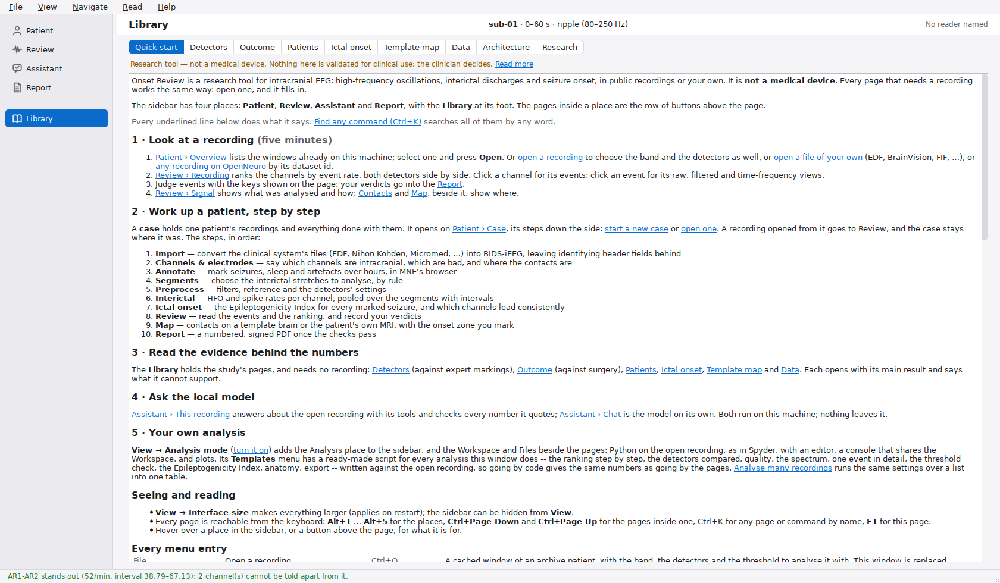
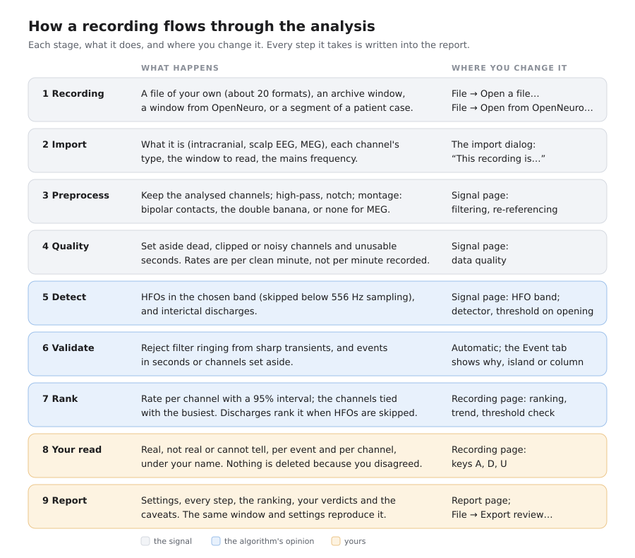
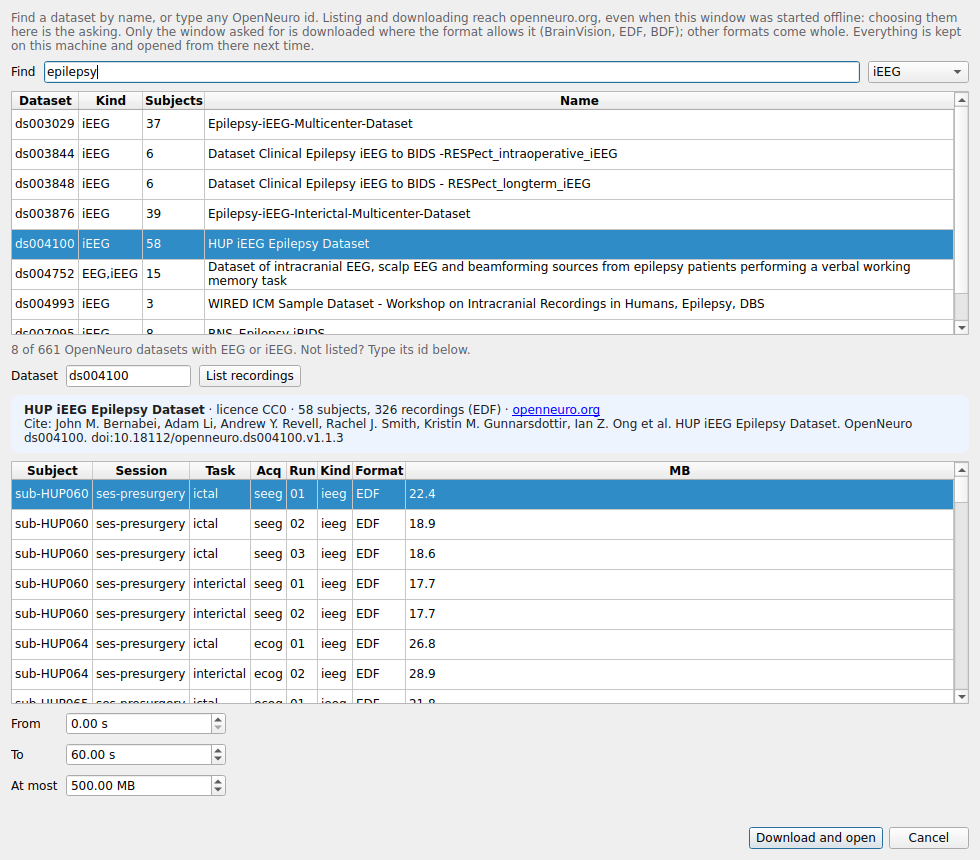
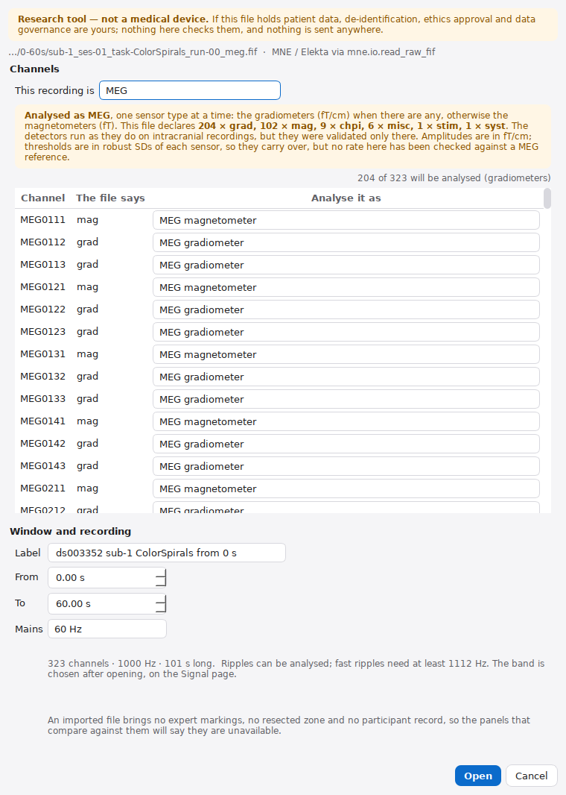
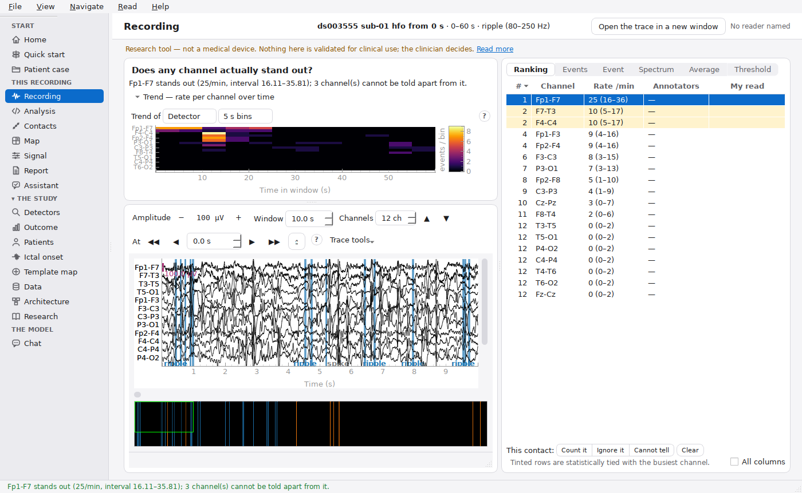
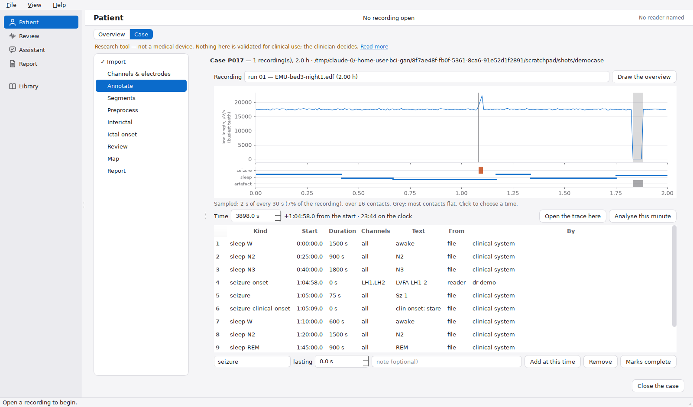
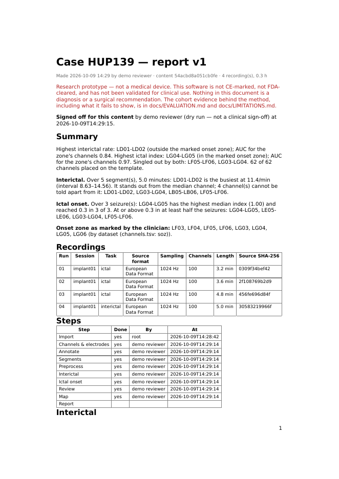
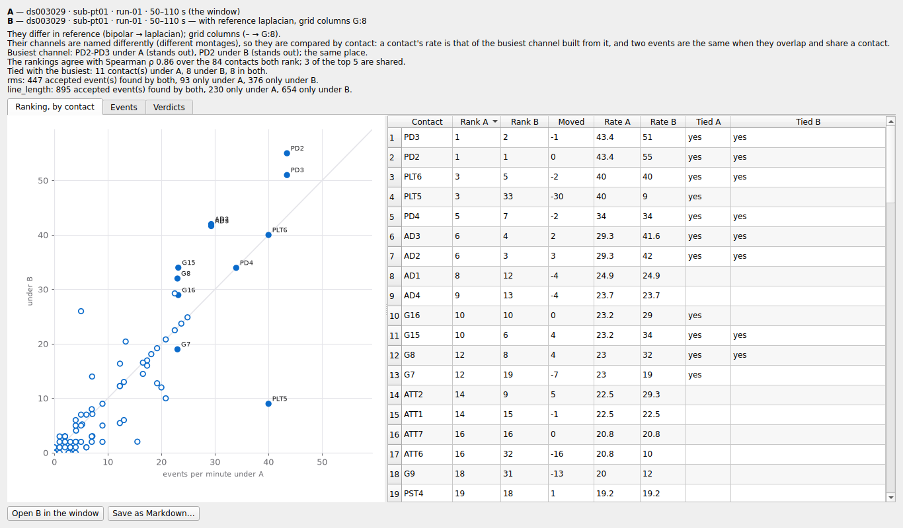

# The Onset-HFO manual

Onset-HFO finds **high-frequency oscillations** (HFOs: ripples, 80–250 Hz, and
fast ripples, 250–500 Hz) and **interictal discharges** in EEG. It ranks the
channels by how often they occur, with intervals that say when two channels
cannot be told apart. It works on intracranial EEG, where it was validated, and
also runs on scalp EEG and MEG, where it was not. It comes as:

- **Onset Review**, a desktop application, for looking at a recording, judging
  what was detected, and working up a patient from raw files to a signed
  report;
- **`onset_hfo`**, a Python package and command line, for the same analysis in
  code;
- an **assistant** on a local open-weight model, which answers only from the
  analysis on screen and never sends anything off the machine.

> **Research tool, not a medical device.** It is not CE-marked or
> FDA-cleared, and nothing in it has been validated against a surgical
> decision. Read [`LIMITATIONS.md`](LIMITATIONS.md) before quoting any number
> it shows.

**How this manual is organised.** Part 1 installs it and shows you around.
Part 2 is nine tutorials, each a task you can do from start to finish in a few
minutes, in the order most people need them. Part 3 is the reference you come
back to. Each tutorial ends with where to read more: the
[clinical guide](CLINICAL_GUIDE.md) describes every panel in depth, and this
manual does not repeat it.

**Contents**

- **Part 1. Getting started**
  - [Install it](#install-it)
  - [Find your way around](#find-your-way-around)
- **Part 2. Tutorials**
  - [1. Your first recording](#tutorial-1-your-first-recording)
  - [2. Is the answer real?](#tutorial-2-is-the-answer-real)
  - [3. A recording of your own](#tutorial-3-a-recording-of-your-own)
  - [4. A public recording from OpenNeuro](#tutorial-4-a-public-recording-from-openneuro)
  - [5. Scalp EEG and MEG](#tutorial-5-scalp-eeg-and-meg)
  - [6. A report, and the assistant](#tutorial-6-a-report-and-the-assistant)
  - [7. A patient case, from files to a signed report](#tutorial-7-a-patient-case-from-files-to-a-signed-report)
  - [8. Many recordings: batch, compare, projects](#tutorial-8-many-recordings-batch-compare-projects)
  - [9. Your own analysis in Python](#tutorial-9-your-own-analysis-in-python)
- **Part 3. Reference**
  - [The pages](#the-pages)
  - [Keyboard](#keyboard)
  - [Settings, and what each costs](#settings-and-what-each-costs)
  - [File formats](#file-formats)
  - [Where things are kept](#where-things-are-kept)
  - [When something goes wrong](#when-something-goes-wrong)
  - [Five things never to conclude](#five-things-never-to-conclude)
  - [Where to read more](#where-to-read-more)

---

# Part 1. Getting started

## Install it

**On Ubuntu or Pop!_OS, from a release** (no git needed). Download
`onset-hfo-<version>-linux.tar.gz` from the release page, then:

```bash
tar xzf onset-hfo-<version>-linux.tar.gz
cd onset-hfo-<version>-linux
./install.sh --with-sample --with-assistant
~/.local/bin/onset-review
```

**From a checkout of the repository:**

```bash
git clone https://github.com/berdakh/onset-hfo.git
cd onset-hfo
./packaging/install-ubuntu.sh --with-sample
onset-review
```

| option | what it adds |
|---|---|
| `--with-sample` | one minute of one patient, so the first launch has something to open (a few MB) |
| `--with-assistant` | the local language model, through Ollama |
| `--with-imaging` | MNE's contact locator, for placing contacts on a patient's CT (a few hundred MB of VTK) |
| `--uninstall` | removes the environment, the command and the menu entry |

The installer puts the Qt libraries in place (one `sudo apt-get`), builds its
own environment under `~/.local/share/onset-review`, and adds **Onset Review**
to the applications menu. Re-run it over an old install to upgrade.

**Python only, any platform.** `pip install -e .` in a checkout gives the
package and the `onset-hfo` command. `pip install -e ".[review]"` adds the
desktop application.

More, including what to do when Qt will not start: [`INSTALL.md`](INSTALL.md).

## Find your way around

Start it from the applications menu, or type `onset-review`. It opens on
**Patient › Overview**, with nothing loaded.


- **The sidebar** holds four places, with the Library at its foot:
  - **Patient**: the recordings on this machine and the ways to open one, and
    a patient's case;
  - **Review**: the open recording, its signal and its contacts;
  - **Assistant**: the local model;
  - **Report**;
  - **Library**: the quick start guide and the study behind every number.
- **The pages inside a place** are the row of buttons above the page:
  *Overview · Case* under Patient, *Recording · Signal · Contacts · Map* under
  Review. This manual names a page by its place: **Review › Signal**.
- **Before anything is open**, every page can still be visited. A page that
  needs a recording says what it shows and offers ways to open one.
- **Quick start** (*Library*, **F1**, or *Help → Quick start guide*) lays the
  program out as the jobs people come with. Every step on it is a link that
  does the step.
- **Find a command** (**Ctrl+K**) searches every menu entry and page by any
  word and runs the one you pick.
- **Alt+1 … Alt+5** go to the places, and **Ctrl+Page Down** and
  **Ctrl+Page Up** to the next and previous page inside one.
- **View → Analysis mode** adds Python on the recording: the Analysis place,
  and the Workspace and Files beside the pages
  ([Tutorial 9](#tutorial-9-your-own-analysis-in-python)). It is off until you
  turn it on.
- **View → Interface size** enlarges text, icons and spacing together.



Everything shown in the window is local. The window starts offline; it
reaches the internet only when you ask for something there, such as a
recording from OpenNeuro.

---

# Part 2. Tutorials

Every tutorial below is some part of one path. A recording comes in, is
prepared, checked, searched and ranked, and then you read it and report it:



The blue rows are the algorithm's opinion and the orange rows are yours. The
software keeps the two apart everywhere: on screen, on disk and in the report.

## Tutorial 1. Your first recording

**You will:** open a minute of a real patient, see which channel stands out,
and record your own judgement of what was detected.

The sample is the first minute of `sub-01` of OpenNeuro `ds003498`:
interictal sleep, 2000 Hz, with two experts' own HFO markings. If you did not
install it, fetch it:

```bash
onset-hfo fetch --subject sub-01 --t-start 0 --t-stop 60
```

1. **Open it.** On **Patient › Overview**, pick *sub-01, 0–60 s* and press
   *Open*. (Or **File → Open a recording…**.) The analysis takes a few
   seconds; **Review › Recording** opens on the result.

   

2. **Read the status bar first.** It says either that one channel stands out,
   with its rate and interval, or that no channel can be told apart from the
   rest. That sentence decides what the rest of the screen is worth.
3. **Look at the trend** at the top: rate per channel over time. Is the
   activity on a few channels, or everywhere?
4. **Look at the ranking** on the right. Tinted rows are channels whose rate
   intervals overlap the busiest one's: statistically tied with it. One
   tinted row means a leader; eight mean a candidate set, not a winner.
5. **Look at the signal.** Click a channel in the ranking: the trace below
   goes to it, with each detection marked. Use the bar above the trace for
   amplitude, seconds on screen and channels on screen.
6. **Open one event.** The **Events** tab lists every detection. Select one;
   the **Event** tab shows it raw, band-passed and as a time-frequency
   picture. A real oscillation is an *island* in that picture; filter ringing
   from a sharp transient is a *column*.
7. **Say who you are**, once, when asked, or start with
   `onset-review --reader "Dr Smith"`. Verdicts are never anonymous.
8. **Judge events.** With the Events list focused, press **A** (real),
   **D** (not real) or **U** (cannot tell); the selection moves on. **N** adds
   a sentence, **Backspace** takes a verdict back, and **Ctrl+J** jumps to the
   next unjudged event.
9. **Judge the channel.** In the ranking, *Count it*, *Ignore it* or *Cannot
   tell*. Nothing is deleted: your verdict goes beside the number.
10. **See what the experts marked.** *View → Overlay expert markings* puts
    their events on the trace. The trend can show their markings too.

Every verdict is saved the moment you give it, against the recording and the
window, so it survives re-running with other settings.

**Read more:** [the window, panel by panel](CLINICAL_GUIDE.md#2-the-window-panel-by-panel);
[recording your read](CLINICAL_GUIDE.md#recording-your-read).

## Tutorial 2. Is the answer real?

**You will:** check whether the ranking from Tutorial 1 survives the choices
behind it.

1. **Change the band.** On the **Signal** page, *HFO band* at the top offers
   ripple or fast ripple; only what the recording's sampling rate can carry
   is offered. Choose *fast ripple* and press *Apply and re-analyse*. Does the
   same channel lead?
2. **Change a filter.** Still on **Signal**, widen the notch to 4 Hz and
   apply. Watch the rates move: that much of the number is a filter choice.
   Settings that would destroy the band, such as a low-pass inside it, are
   refused with a reason, not applied.

   

3. **Check the quality verdicts.** Lower on **Signal**, every channel has a
   quality verdict and the seconds that were usable. A channel set aside is
   not ranked. A channel flagged *HF outlier* needs looking at on the trace:
   the software cannot tell a noisy amplifier from a great deal of real
   activity.
4. **Raise the threshold.** The **Threshold** tab on Recording re-ranks at
   stricter thresholds. A leader that survives is worth more than one that
   does not.
5. **Look at another minute.** **File → Next window** (**Ctrl+Shift+Right**)
   analyses the next minute of the same recording, keeping your name and
   layout. **Go to window…** (**Ctrl+G**) goes anywhere. Does the answer hold?

The last step surprises most people. Across the twenty patients of this
dataset, even the experts' busiest fast-ripple channel is the same in two
different minutes of the same recording for only 7 of 20 patients. A
one-minute answer, from anyone, is less stable than it looks.

**Read more:** [the settings and what they cost](CLINICAL_GUIDE.md#4-the-settings-you-can-change-and-what-they-cost);
[analysing more than a minute](CLINICAL_GUIDE.md#analysing-more-than-a-minute).

## Tutorial 3. A recording of your own

**You will:** open a clinical file, tell the software what its channels
really are, and analyse it.

1. **File → Open a file…** and pick the recording. For a BrainVision
   recording pick the `.vhdr`; for a recording that is a folder (MEF3, CTF,
   Neuralynx), pick any file inside it. [File formats](#file-formats) lists
   what is read.
2. **Say what the recording is.** *This recording is…* offers intracranial
   EEG, scalp EEG or MEG. MEG is guessed when the file declares MEG sensors;
   otherwise intracranial is guessed, because clinical exports declare their
   intracranial contacts as scalp EEG too. Changing it suggests every
   channel's type again.

   

3. **Check the channel list. This is the step that matters.** A clinical
   export usually types every channel `eeg`, including the EKG and the DC
   channels. The column *The file says* shows the file's claim and *Analyse it
   as* shows what will be analysed. Set them all with one button (*All as
   SEEG*, *All as ECoG*), then fix the exceptions: the EKG as ECG, the DC and
   trigger channels as not analysed. The count beside the buttons is the
   number that will actually be analysed.
4. **Choose the window and the mains.** *From* and *To* bound what is read,
   since a night of EEG is tens of gigabytes. *Mains* is 50 or 60 Hz and is
   not read from the file. Notching the wrong one leaves the interference in
   and carves a hole where there was none.
5. **Open.** The band is chosen afterwards, on the **Signal** page. The
   dialog only says what the file's rate allows.

**A recording sampled too slowly.** Many archives record at 500 or 512 Hz,
and ripples need at least 556 Hz. Such a file still opens. HFO detection is
skipped, the channels are ranked by interictal discharges instead, and the
window's notes say so first.

**From the command line:** `onset-review --open /data/study-001.edf` opens
the same dialog with the file chosen. `--all-channels-as seeg`,
`--channel-type 'EKG=ecg'` and `--window 0 60` fill it in.

**Read more:** [opening a recording of your own](CLINICAL_GUIDE.md#5-opening-a-recording-of-your-own).

## Tutorial 4. A public recording from OpenNeuro

**You will:** find a public dataset, download one window of one recording,
and open it.

1. **File → Open from OpenNeuro…**, or *From OpenNeuro…* on Patient › Overview.
2. **Find a dataset.** Type words such as *epilepsy* to search the bundled
   catalogue of 748 OpenNeuro datasets with EEG, iEEG or MEG, and narrow by
   kind. Or type an id such as `ds004100`.

   

3. **List its recordings.** The dialog shows the dataset's name, licence and
   citation, and every recording with its format and size.
4. **Choose a window and download.** For BrainVision, EDF and BDF only the
   window is fetched. Other formats, MEG among them, come whole, refused above
   a size you set. A progress bar shows the download, and *Stop* abandons it
   without keeping anything.
5. **Confirm.** The window comes through the import dialog of Tutorial 3, with
   the dataset's own channel types, bad channels and mains frequency already
   filled in.

Everything downloaded is kept, and the same window opens from disk next time.

**In Python**, the way `sklearn.datasets` works:

```python
from onset_hfo import openneuro

openneuro.catalogue(search="epilepsy", modality="ieeg")   # find a dataset
openneuro.list_openneuro("ds004100")                      # its recordings
bunch = openneuro.fetch_openneuro("ds004100", subject="HUP060", task="ictal",
                                  t_start=100, t_stop=130)
bunch.data, bunch.times, bunch.ch_names, bunch.sfreq     # volts, seconds
bunch.recording                                          # ready for the pipeline
bunch.license, bunch.citation
```

**On the command line:**
`onset-hfo openneuro catalogue --search epilepsy --kind ieeg`, then
`onset-hfo openneuro fetch ds004100 --subject HUP060 --t-start 100 --t-stop 130`.

**Read more:** [`DATA.md`](DATA.md), the OpenNeuro section.

## Tutorial 5. Scalp EEG and MEG

**You will:** analyse a scalp or MEG recording, and know what its numbers
are worth.

1. **Open it** as in Tutorial 3 or 4, and say *Scalp EEG* or *MEG* in the
   import dialog. A file that declares MEG sensors opens as MEG by itself.
   Each sensor can be re-typed only as another sensor type or as not
   analysed, and the count says which sensor type will be analysed.

   

2. **What changes.**
   - **Scalp EEG** is read in µV. *Bipolar* means the longitudinal "double
     banana" (Fp1-F7-T7-P7-O1 and the rest); the older T3/T4/T5/T6 names
     work too.
   - **MEG** is read one sensor type at a time: planar gradiometers in
     fT/cm, or magnetometers in fT. It is never re-referenced, and the trace
     is labelled in its own unit.
3. **Read the first preprocessing step.** On every scalp or MEG window it
   says that the detectors were validated only on intracranial recordings.

   

   In this minute the busiest channel is frontal (Fp1-F7), where muscle and
   eye movement sit. Open its events before believing the rate.
4. **Ignore Contacts and Map for placement.** Those pages lay channels out as
   implanted contacts, by shaft name. On scalp EEG or MEG they say that what
   they draw is a diagram of the names, not where the sensors are.

**What the numbers are worth.**

- **Scalp EEG.** Against a published scalp detector on ten children's sleep
  EEG (ds003555), the channel ranking agreed with its final events at a
  median Spearman ρ of 0.73. This detector has no equivalent of that
  detector's artefact rejection, so on noisy recordings it counts several
  times as many events.
- **MEG.** On the one recording of a person tried, the detections were far
  too large to be brain ripples. Treat MEG rates as unvalidated.

**Read more:** [`MODALITIES.md`](MODALITIES.md).

## Tutorial 6. A report, and the assistant

**You will:** write up a window and ask the local model about it.

1. **The findings paragraph.** On the **Report** page, write your conclusion,
   or ask the assistant to draft one. The report says whose words they are.

   

2. **Export.** **File → Export review…** writes everything to a file: the
   provenance, the settings, the ranking with intervals, your verdicts
   (including the ones where you disagreed with the detector), how much was
   judged, and the caveats. Re-running the same window with the same settings
   reproduces it exactly.
3. **The assistant.** The **Assistant** page answers questions about the
   window on screen from the analysis itself, with its sources. It refuses
   what the evidence cannot support. Ask it something you can check in the
   table, then ask it which channels to resect, and read the refusal.

   

4. **Set up the model.** If the assistant is not installed, the Assistant
   page offers to set it up: it checks for Ollama, chooses a model this
   machine can run, and downloads it with progress. *Help → Test the local
   model…* checks it.
5. **Chat** is the same model on its own, unconnected to the recording, for
   general questions.

Nothing typed into the assistant or the chat leaves the machine.

**Read more:** [the assistant](CLINICAL_GUIDE.md#assistant--ask-about-this-window);
[`AGENT.md`](AGENT.md) for how it is kept to the evidence.

## Tutorial 7. A patient case, from files to a signed report

**You will:** take one patient's whole monitoring through all ten steps.

A **case** is a folder holding one patient's recordings, converted once into
BIDS-iEEG, the open standard, with every change kept in an audit log.

1. **File → New case…**: a folder and a **pseudonym** (P017, never a name).
   **File → Open case…** or `onset-review /path/to/case` reopens one. The
   case opens on **Patient › Case**, in the same window.

   

2. Work down the steps on the left of the case. A tick appears beside each
   one done. A recording opened from the case goes to **Review**, and the
   case stays on Patient › Case, where you left it, until you press
   *Close the case*.

| step | what you do there |
|---|---|
| **Import** | add each file from the clinical system; see what it holds before anything is written. Nothing that names the patient is kept. |
| **Channels & electrodes** | confirm each channel's type, mark bad channels, group contacts into electrodes |
| **Annotate** | hours at a glance; mark seizures, sleep stages and artefacts in MNE's browser |
| **Segments** | choose stretches by rule: sleep stage, away from seizures and artefacts |
| **Preprocess** | one set of signal settings for every segment |
| **Interictal** | analyse every segment alike and pool them into one ranking with intervals |
| **Ictal onset** | where each marked seizure starts (the Epileptogenicity Index), and how consistent that is across seizures |
| **Review** | open any segment in the review window of Tutorial 1 |
| **Map** | place the contacts on a template brain (imported, or planned on the template), or from the patient's own CT and MRI, with atlas labels |
| **Report** | check the case for anything identifying, take reviewers' sign-offs, produce numbered PDF reports |

3. **Sign off.** Each reviewer signs the content they approve. The log is
   chained, so a later change to anything signed shows.



**Read more:** [a case, step by step](CLINICAL_GUIDE.md#5a-a-case-one-patients-recordings-step-by-step);
[`ICTAL.md`](ICTAL.md); [`TEMPLATE_MAP.md`](TEMPLATE_MAP.md);
[`IMAGING.md`](IMAGING.md).

## Tutorial 8. Many recordings: batch, compare, projects

**You will:** analyse many recordings alike, compare two analyses, and save
your work.

- **Batch.** **File → Analyse many recordings…** queues recordings, runs them
  all with the same settings, and shows one table with the busiest channel of
  each, the spread between detectors and any outlier. *Add to your cohort*
  makes the batch a cohort for the study pages.

  

- **Compare.** **File → Compare with → This recording with other settings…**
  analyses the same window again with another reference, band or threshold,
  and lines the two up: what differs, the busiest channel under each,
  Spearman's ρ between the rankings, and the shared top five.

  

- **Projects.** **File → Save project…** keeps a whole analysis, settings and
  verdicts included. **File → Open project…** brings it back.

**Read more:** [many recordings at once](CLINICAL_GUIDE.md#many-recordings-at-once-and-a-project-to-keep);
[two analyses side by side](CLINICAL_GUIDE.md#two-analyses-side-by-side).

## Tutorial 9. Your own analysis in Python

**You will:** reproduce the window's analysis in code, then change it.

**Inside the app.** Turn on **View → Analysis mode** (**Ctrl+Shift+E**). The
sidebar gains an **Analysis** place: an editor, a console and a workspace
sharing the open recording's objects (`raw`, `events`, `findings`, `quality`
and the rest). The Workspace and Files panes appear beside the other pages.
Turn the mode off and they go; nothing in them is lost.


1. Open a recording, turn on Analysis mode, then go to **Analysis**.
2. The editor's **Templates** menu has a ready-made script for every analysis
   the window does: the ranking step by step, rates with intervals, the
   detectors compared, quality, the spectrum, one event in detail, the
   Epileptogenicity Index, fetching from OpenNeuro, saving everything as CSV.
3. Run a cell with **Ctrl+Enter**. Plots appear in the Plots pane, and every
   command run goes in the report.

**Outside the app.** The same analysis, on the labelled synthetic recording
that needs no download:

```python
from onset_hfo.pipeline import run_pipeline
from onset_hfo.synthetic import make_synthetic_recording

recording = make_synthetic_recording(duration_s=60)
result = run_pipeline(recording, detectors=("rms",))
print(result.rates["rms"].head())     # per-channel rates, busiest first
print(result.prepared.steps)          # every preprocessing step, in order
```

On a file of your own, typed as in Tutorial 3:

```python
from onset_hfo.config import PipelineConfig, PreprocessConfig
from onset_hfo.io import open_recording
from onset_hfo.pipeline import run_pipeline

recording = open_recording("study-001.edf", t_start=0, t_stop=60, line_freq=50,
                           channel_types={"EKG": "ecg", "DC1": "misc"})
config = PipelineConfig()
config.preprocess = PreprocessConfig(modality="ieeg")   # or "eeg", "meg"
result = run_pipeline(recording, config=config, save_to="results/study-001")
```

`save_to` writes the tables, the steps and a report. A recording too slow
for the HFO band gives `result.hfo_skipped`, a sentence saying why.

**On the command line:**

| command | what it does |
|---|---|
| `onset-hfo run --synthetic` | the whole pipeline on the synthetic recording |
| `onset-hfo run --subject sub-pt01 --task ictal --run 01 --start 50 --stop 110 --figures` | a window of the ictal archive (`ds003029`), with figures |
| `onset-hfo fetch --subject sub-01` | cache a window for the app to open offline |
| `onset-hfo openneuro catalogue\|list\|describe\|fetch` | Tutorial 4 |
| `onset-hfo benchmark` | score the detectors against the experts' markings |
| `onset-hfo outcome` | test the HFO map against surgical outcome |
| `onset-hfo stability` | is the ranking stable across windows? |
| `onset-hfo stream` | detect over a recording longer than memory |
| `onset-hfo report` | print a saved report |

`onset-hfo <command> --help` lists each one's options.

**Read more:** [`METHODS.md`](METHODS.md) for every algorithm and threshold;
[`ARCHITECTURE.md`](ARCHITECTURE.md) for how the package fits together;
the notebooks in `notebooks/`.

---

# Part 3. Reference

## The places and their pages

| place › page | what it is for |
|---|---|
| **Patient › Overview** | the windows on disk, grouped by patient; open, continue, or import |
| **Patient › Case** | the open case, its ten steps down the side; with none open, *New case…* and *Open a case…* |
| **Review › Recording** | the trend, the trace, the ranking, the events, one event, spectrum, average event, threshold |
| **Review › Signal** | the HFO band, preprocessing, data quality, ICA components |
| **Review › Contacts** | the patient record, and the contacts in 3D, measured or schematic |
| **Review › Map** | the contacts flat, coloured by rate |
| **Assistant › This recording** | questions about this window, answered from its analysis |
| **Assistant › Chat** | the local model on its own |
| **Report** | the findings paragraph and the export |
| **Library** | the quick start guide, and the published results (Detectors, Outcome, Patients, Ictal onset, Template map, Data, Architecture, Research) with this recording beside them |
| **Analysis** | in Analysis mode only: editor, console and workspace on the open recording; templates |

## Keyboard

| keys | what they do |
|---|---|
| **F1** | Quick start |
| **Ctrl+K** | find a command |
| **Alt+1 … Alt+5** | Patient, Review, Assistant, Report, Library |
| **Ctrl+Page Down**, **Ctrl+Page Up** | the next and previous page inside a place |
| **Ctrl+Shift+E** | Analysis mode on or off |
| **A**, **D**, **U** | judge the selected event: real, not real, cannot tell |
| **N** | a note on the event |
| **Backspace** | take a verdict back |
| **Ctrl+1**, **Ctrl+2**, **Ctrl+3** | the same verdicts from anywhere |
| **Ctrl+J** | next unjudged event |
| **Ctrl+Shift+Right** | next window of the same recording |
| **Ctrl+G** | go to a window |
| **Ctrl+Enter** | run a cell on the Analysis page |

*Help → Keyboard shortcuts (MNE trace)* lists the trace's own keys.

## Settings, and what each costs

| setting | where | default | what it costs to change |
|---|---|---|---|
| band | Signal → HFO band | ripple | fast ripples are rarer and more specific; they need at least 1112 Hz |
| detector | open dialog | RMS energy | four detectors agree on about half the individual events |
| threshold | open dialog, Threshold tab | each detector's measured default | lower finds more, and more noise |
| reference | Signal | bipolar | a common reference shares its noise with every channel |
| notch | Signal | the dataset's mains, 2 Hz wide | wide notches carve holes in the band |
| high-pass | Signal | 1 Hz | anything up to 80 Hz is free; above that it eats the ripple band |
| quality checks | Signal | on | off reproduces numbers measured before the stage existed |

The full table, with why each default is what it is:
[the settings you can change](CLINICAL_GUIDE.md#4-the-settings-you-can-change-and-what-they-cost).

## File formats

| system | what to open |
|---|---|
| EDF, EDF+, BDF, GDF (Micromed, Natus and most clinical exports) | `.edf`, `.bdf`, `.gdf` |
| BrainVision | `.vhdr` |
| Nihon Kohden | `.eeg` |
| Persyst | `.lay` |
| Nicolet | `.data` |
| Blackrock | `.ns3`, `.ns5` |
| MEF3 | any file inside the `.mefd` folder |
| Neuralynx | any `.ncs` in the folder |
| Curry, EEGLAB, EGI, Neuroscan, Eximia | `.cdt`, `.set`, `.mff`, `.cnt`, `.nxe` |
| MNE, and MEGIN/Elekta MEG | `.fif` |
| CTF MEG | any file inside the `.ds` folder |
| KIT/Yokogawa MEG | `.sqd`, `.con` |

A patient case also reads Micromed natively when `neo` is installed.

## Where things are kept

| what | where |
|---|---|
| archive windows | `artifacts/data/` |
| OpenNeuro downloads and the refreshed catalogue | `$ONSET_HFO_DATA`, else `artifacts/data/openneuro/` |
| your verdicts | `artifacts/reads/` (or `$ONSET_REVIEW_READS`), written as you give them |
| a case | the folder you chose, in BIDS-iEEG, with `case.json` and its log |
| results from the command line | `artifacts/results/`, or `--out` |
| all of the above at once | `$ONSET_HFO_HOME` moves `artifacts/` anywhere |
| the log file | *Help → Report a problem…* shows where |

## When something goes wrong

- **Qt will not start** ("could not load the Qt platform plugin xcb"): the Qt
  libraries are missing; see [`INSTALL.md`](INSTALL.md).
- **A recording opens but every channel is set aside:** look at the
  amplitudes on the Signal page. Values in volts rather than microvolts mean
  the file did not state its unit.
- **A download is refused:** some OpenNeuro datasets are listed but not yet
  public. The error says so; download them from openneuro.org instead.
- **The assistant does not answer:** *Help → Test the local model…*.
- **Anything else:** *Help → Report a problem…* gathers the log and the
  versions into a report you can send.

## Five things never to conclude

1. "The busiest channel is the seizure onset zone."
2. "No channel stands out, so there is nothing here."
3. "The detector agrees with the expert, so it is right."
4. "The 3D view shows where the electrodes are." Without a coordinate file,
   it shows where electrodes with those names usually go.
5. "This tells me what to resect."

Why each is wrong: [the five things never to conclude](CLINICAL_GUIDE.md#7-the-five-things-never-to-conclude-from-this-screen).

## Where to read more

| if you want | read |
|---|---|
| every panel, in depth | [`CLINICAL_GUIDE.md`](CLINICAL_GUIDE.md) |
| installing, and fixing an install | [`INSTALL.md`](INSTALL.md) |
| the recordings, OpenNeuro, your own data | [`DATA.md`](DATA.md) |
| every algorithm and threshold | [`METHODS.md`](METHODS.md) |
| what has been measured | [`EVALUATION.md`](EVALUATION.md), [`OUTCOME.md`](OUTCOME.md), [`ICTAL.md`](ICTAL.md) |
| scalp EEG and MEG | [`MODALITIES.md`](MODALITIES.md) |
| the assistant | [`AGENT.md`](AGENT.md) |
| terms | [`GLOSSARY.md`](GLOSSARY.md) |
| **what not to claim** | [`LIMITATIONS.md`](LIMITATIONS.md) |
