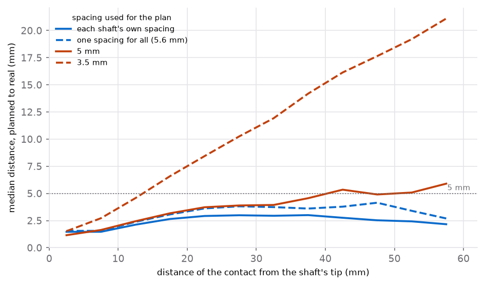

# Contacts on a template brain: how far off, and what a label is worth

Without the patient's own CT and MRI, the case window's **Map** step places
contacts on a template brain (MNI152). They are either imported from a
planning system's export, or planned there: a depth electrode as a straight
line from its target towards its entry point, one contact every few
millimetres. Each contact then gets a *probable* atlas structure
(`onset_hfo/case/atlas.py`, `onset_hfo/case/electrodes.py`).

This page measures what that costs, against real implants on the same
template. The data are OpenNeuro `ds004100` (the HUP iEEG dataset, CC0): 38
SEEG patients whose contacts were localised on their own imaging and
published in fsaverage space. Their positions were moved to MNI152 with
FreeSurfer's linear transform.

```bash
python -m onset_hfo.template_study artifacts/results/template_ds004100   # ~1 min, 38 small files
```

The tables are committed to [`data/template/`](../data/template).

---

## The headline

**On real implants, a straight line from the deepest contact towards the last
lands a median 2.5 mm from the real contacts when it uses the shaft's own
spacing, and 84% of contacts fall within 5 mm.** The line itself is not the
problem. Real shafts on the template stray a median 1.4 mm from a straight
line, and the furthest contact of a typical shaft 3.4 mm.

**The spacing is the problem.** A template is not the patient's size, and the
spacing between neighbouring contacts *on the template* was 5.0–6.4 mm for
most shafts (10th–90th percentile, median 5.6 mm). The archive does not say
the catalogue pitch of these electrodes. A plan at 3.5 mm, a common catalogue
pitch, lands a median 10 mm off, and only 22% of contacts fall within 5 mm.
The error grows by about 2 mm for every 5 mm along the shaft.

**An atlas label is weaker than a position.** Even at the *real* position, the
atlas puts only 51% of contacts inside a named structure; 32% are near one
(within 5 mm), 10% are in white matter, and 7% fall outside the template brain
altogether. A plan with the right spacing gives the same label as the real
position for 70% of contacts. With the 3.5 mm pitch, 31%.



---

## What was done

**Shafts.** Contacts named as a prefix and a number (`LAF1`, `LAF2`, …), with
at least four placed contacts: 501 shafts and 4,745 contacts from 38
patients. A shaft's contacts are ordered by number, and contact 1 is taken as
its deepest. This is the planner's convention, and the HUP naming follows it.

**The plan.** Each plan was given the best inputs a person could have: the
real deepest contact as the target, and the real last contact for the
direction. Only one thing is chosen, the spacing:

| plan | spacing |
|---|---|
| own | the shaft's own median distance between neighbouring contacts, on the template |
| common | one value for every shaft: the median of the above, 5.6 mm |
| 5 mm, 3.5 mm | two common catalogue pitches |

A person choosing the target and entry on a template, from an operative note
or a planning screenshot, adds error that this study does not measure. These
numbers are the best case of the planner, not its typical case.

**The atlas.** Harvard-Oxford, cortical (lateralised) and subcortical, at a
25% probability threshold, in MNI152NLin2009cAsym at 1 mm, from TemplateFlow.
Each position is either **in** a named structure (a cortical region, or a
deep one such as the hippocampus or amygdala), or **near** the nearest named
structure within 5 mm, or in **white matter**, or **outside the brain**. "The
same label" means the same of these four *and* the same structure.

**The coordinates.** HUP's files give positions in millimetres while their
`coordsystem.json` says metres. The reader goes by the values: every value
under 1 is read as metres, anything else as millimetres. It says so on
import.

---

## Results

Contacts after the tip (the tip itself is the target, so its error is zero by
construction):

| plan | contacts | median error | 90th percentile | within 5 mm | same atlas label |
|---|---:|---:|---:|---:|---:|
| own spacing | 4,208 | **2.5 mm** | 6.0 mm | 84% | 70% |
| one spacing for all (5.6 mm) | 4,244 | 3.0 mm | 7.1 mm | 78% | 65% |
| 5 mm | 4,244 | 3.6 mm | 8.4 mm | 68% | 61% |
| 3.5 mm | 4,244 | 10.1 mm | 20.8 mm | 22% | 31% |

Ten shafts have no two neighbouring contacts both placed, so they have no
spacing of their own. They are left out of the first row and kept in the
others.

**At the real positions**, the atlas says:

| | share of contacts |
|---|---:|
| in a named structure | 51% |
| near one (within 5 mm) | 32% |
| white matter | 10% |
| outside the template brain | 7% |

Of the contacts outside, 92% are in the outer third of their shaft, against
36% of all contacts. These are the contacts nearest the entry, where the
patient's cortex and the template's part company.

---

## What this means for the Map step

- **Set the spacing to the template's, not the catalogue's.** The planner's
  default is 5 mm, and its tooltip gives the HUP range. If the clinic's
  electrodes are 3.5 mm apart in the patient, the plan on the template will
  usually need more. Where a planning system can export template
  coordinates, import them instead.
- **Read a label as "probably", and a "near" as a guess.** The window and the
  files never drop the word. A contact's label is shown with how it was
  found, and a bipolar channel with both of its contacts' labels.
- **Use the map to see which shafts and regions the busy and early channels
  are on, not to place a single contact in a gyrus.** At a few millimetres of
  error, the shaft and the lobe are reliable. The gyrus is often not.

---

## What this does not cover

- grids and strips (flat sheets on a curved cortex are worse, by an amount not
  measured here);
- error in choosing the target and entry, which is likely the largest part
  in practice;
- other templates and atlases, and patients whose anatomy is far from the
  average (lesions, prior resections).
